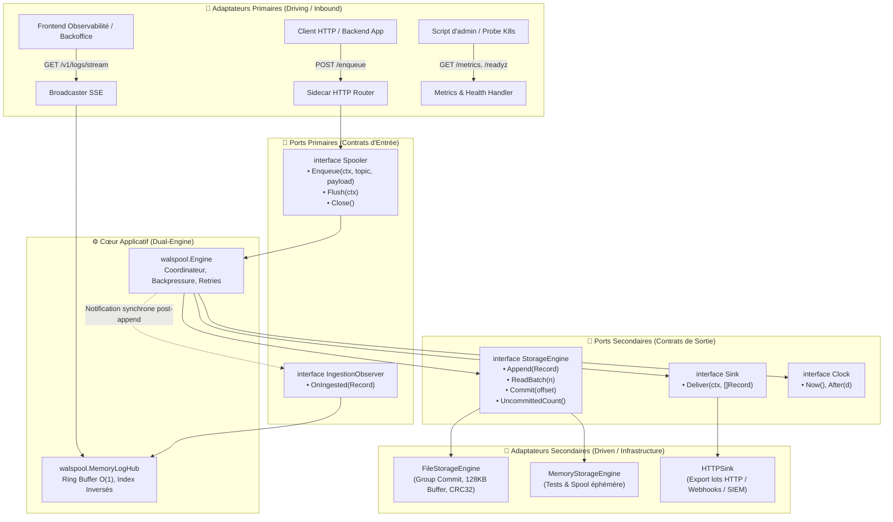
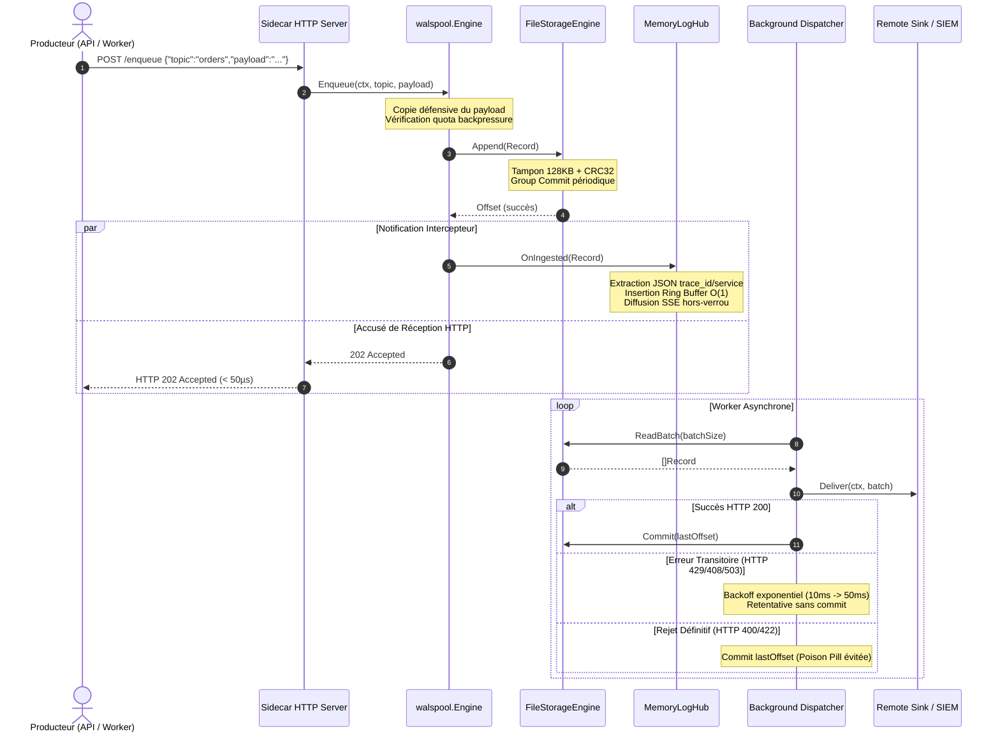
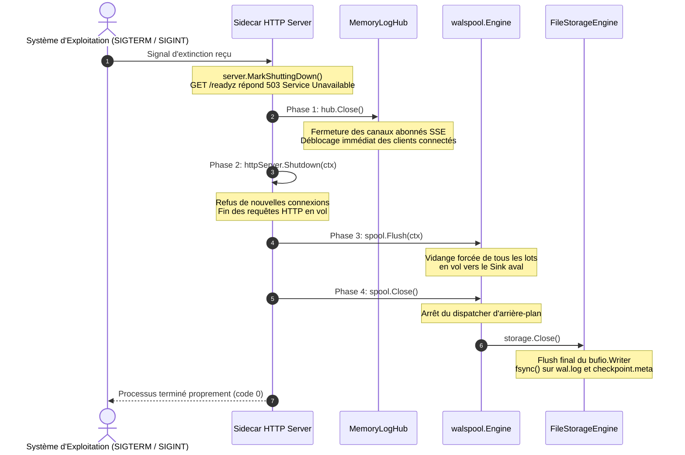

# Architecture Logicielle de Walspool

Ce document présente l'architecture logicielle de **Walspool** (`github.com/YohannHommet/walspool`), un moteur double-moteur (Dual-Engine) alliant la persistance locale sur disque par journal séquentiel (**Write-Ahead Log - WAL**) et un index mémoire circulaire (**MemoryLogHub**) avec streaming Server-Sent Events (SSE).

L'architecture respecte strictement les principes de la **Doctrine Black-Box** (David Parnas, Bertrand Meyer, Alistair Cockburn, John Ousterhout).

---

## 1. Vue d'Ensemble Hexagonale (Ports & Adapters)

Walspool sépare hermétiquement les **contrats métier** de ses **adaptateurs d'infrastructure** (disque, réseau HTTP, flux SSE). Le cœur applicatif ne dépend d'aucun framework externe.



---

## 2. Le Modèle Dual-Engine

Walspool opère simultanément deux moteurs complémentaires sur chaque enregistrement entrant :

| Caractéristique | Moteur Disque (FileStorageEngine) | Moteur Mémoire (MemoryLogHub) |
| :--- | :--- | :--- |
| **Objectif** | Durabilité absolue, garantie zéro perte | Observabilité temps réel, latence sub-milliseconde |
| **Persistance** | Fichier append-only séquentiel (`wal.log`) | Ring buffer circulaire volatil (ex: 50 000 logs) |
| **Éviction** | Checkpoint et commit après livraison aval | Éviction circulaire $O(1)$ du log le plus ancien |
| **Intégrité** | Somme de contrôle IEEE CRC32 scellant chaque frame | Copie défensive de payload et normalisation JSON |
| **Indexation** | Séquentielle par `Offset` (uint64) | Index inversés par `trace_id` et par `service` |
| **Débit Certifié** | **2 242 513 ops/sec** (Group Commit 128 Ko) | **1 680 921 ops/sec** (1 alloc/op) |

### Flux d'Ingestion Unifié (`POST /v1/enqueue`)



---

## 3. Détail des Composants Internes

### 3.1. Moteur de Stockage Fichier (`FileStorageEngine`)
Le composant `storage_file.go` matérialise le Write-Ahead Log physique sur disque.

- **Encapsulation Stricte** : La table d'offsets physique `offsetPos` est un détail d'implémentation strictement privé. L'interface externe `StorageEngine` ne manipule que des types de domaine (`Offset`, `Record`).
- **Group Commit & Buffering** :
  * `SyncPolicy = SyncInterval` : Écritures tamponnées dans un `bufio.Writer` de 128 Ko avec vidange périodique (`FlushInterval = 50ms`). Ce mode délivre plus de **2.2 millions d'opérations/seconde** sur SSD NVMe.
  * `SyncPolicy = SyncBatchCommit` : Synchronisation fsync déclenchée à la clôture de chaque batch.
  * `SyncPolicy = SyncEveryRecord` : `fsync()` unitaire synchrone pour les scénarios financiers ultra-rigides.
- **Récupération sur Panne (Crash Recovery) avec Troncature Atomique** :
  * Lors du redémarrage, `recover()` relit séquentiellement chaque frame.
  * Si une écriture a été interrompue brutalement (coupure d'alimentation, panique système), le moteur détecte l'incohérence CRC32 ou la troncature de frame en fin de fichier et invoque immédiatement `walFile.Truncate(validFileEnd)` pour éliminer les octets corrompus et restaurer un état valide.
  * Les métadonnées de checkpoint (`checkpoint.meta`) utilisent un renommage atomique POSIX précédé d'un `fsync` sur le fichier temporaire et sur le répertoire parent.

### 3.2. Index Mémoire Circulaire & Streaming (`MemoryLogHub`)
Le composant `hub.go` garantit la disponibilité immédiate des journaux pour l'observabilité.

- **Ring Buffer $O(1)$ Bounded** :
  * Tableau circulaire de taille fixe ($N$ éléments, par défaut 50 000) adressé par modulo bitwise ou index de séquence.
  * Lorsque la capacité est atteinte, le pointeur de queue avance et écrase l'enregistrement le plus ancien en $O(1)$ temps et mémoire sans aucune allocation mémoire sur le tas.
- **Index Inversés Découplés** :
  * `byTraceID map[string][]uint64` : Indexation instantanée des pointeurs d'enregistrement par identifiant de trace distribuée.
  * `byService map[string][]uint64` : Indexation insensible à la casse (`strings.ToLower`) par nom de microservice.
  * Les clés nettoyées par l'écrasement circulaire sont évincées automatiquement pour prévenir toute fuite mémoire.
- **Streaming SSE Découplé Hors Verrou** :
  * Pour éviter qu'un client HTTP lent ne ralentisse l'ingestion générale, la diffusion SSE s'effectue en deux phases :
    1. *Sous verrou de lecture/écriture* : Insertion dans le ring buffer, copie instantanée de la slice des abonnés actifs.
    2. *Hors verrou* : Émission non-bloquante (`select ... default`) vers le channel tamponné de chaque abonné. Si un abonné sature son buffer, l'événement est abandonné pour ce client et le compteur `walspool_dropped_events_total` est incrémenté atomiquement.
- **Requêtes Optimisées en $O(k)$ Bounded** :
  * La méthode `Query(q LogQuery)` itère à rebours (du plus récent au plus ancien) bornée strictement par `q.Limit`, assurant une réponse en **moins de 20 microsecondes** avec allocation mémoire minimale.

### 3.3. Coordinateur & Dispatcher d'Arrière-Plan (`Engine`)
Le composant `engine.go` implémente le contrat `Spooler`.

- **Contrat IngestionObserver** :
  * Dès qu'un enregistrement est sérialisé avec succès sur le disque via `storage.Append(rec)`, l'événement est notifié à tous les observateurs enregistrés via `WithObserver(obs)`.
- **Worker de Vidange (Dispatcher)** :
  * Tourne dans une goroutine dédiée.
  * Extrait les lots (`ReadBatch`) jusqu'à concurrence de `cfg.BatchSize` et les transmet au `Sink`.
  * En cas d'erreur transitoire (`IsTransient(err)`), il applique un backoff exponentiel (`cfg.InitialBackoff` jusqu'à `cfg.MaxBackoff`).
- **Flush Conscient du Contexte** :
  * L'appel `Flush(ctx context.Context)` transmet une requête `flushRequest` au dispatcher contenant le `ctx`.
  * Si le Sink renvoie temporairement une erreur 429 ou 408, le dispatcher rejoue avec backoff jusqu'à expiration du contexte ou succès, garantissant une vidange fiable sans échec prématuré.

---

## 4. Contrats d'Erreurs 3-Tiers

Walspool applique un découpage des erreurs en 3 niveaux d'isolation :

```
┌────────────────────────────────────────────────────────┐
│ NIVEAU 1 : Violations de Préconditions (Appelant)     │
│  - ErrPreconditionViolated (argument nil ou invalide) │
│  - ErrRecordTooLarge (payload > MaxPayloadSize)        │
│  - ErrInvalidConfig (configuration incohérente)        │
└────────────────────────────────────────────────────────┘
                           │
┌────────────────────────────────────────────────────────┐
│ NIVEAU 2 : Rejets Domaine & Backpressure (Contrôlé)    │
│  - ErrSpoolFull (quota mémoire/disque dépassé)        │
│  - ErrSpoolerClosed (processus en cours d'extinction) │
│  - ErrTruncatedData (frame incomplète en fin de WAL)  │
│  - ErrCorruptRecord (checksum CRC32 invalide)          │
└────────────────────────────────────────────────────────┘
                           │
┌────────────────────────────────────────────────────────┐
│ NIVEAU 3 : Défaillances Infrastructure & Sink          │
│  - ErrSinkUnavailable (HTTP 429/408/503 - Rejouable)   │
│  - ErrPermanentRejection (HTTP 400/422 - Dead-letter) │
└────────────────────────────────────────────────────────┘
```

---

## 5. Séquence d'Arrêt Gracieux (Graceful Shutdown)

L'extinction ordonnée en 4 phases garantit l'intégrité du système sans perte d'événements en vol :



---

## 6. Observabilité & Télémétrie

Le sidecar expose 7 endpoints HTTP/SSE unifiés :

| Méthode & Chemin | Description & Objectif |
| :--- | :--- |
| `POST /enqueue` / `POST /v1/enqueue` | Ingestion synchrone WAL + Hub ($< 50\mu\text{s}$) avec code `202 Accepted`. |
| `GET /v1/logs` | Requête historique sur le Ring Buffer avec filtres `trace_id`, `service`, `level`, `limit`. |
| `GET /v1/logs/stream` | Flux Server-Sent Events (SSE) temps réel avec keepalive toutes les 10s. |
| `GET /metrics` | Métriques standardisées au format OpenMetrics / Prometheus. |
| `GET /healthz` | Sonde de vivacité Kubernetes (Liveness Probe - `200 OK`). |
| `GET /readyz` | Sonde d'aptitude Kubernetes (Readiness Probe - `200 OK` si opérationnel, `503` en shutdown ou panne). |
| `POST /flush` | Déclenchement manuel de vidange des enregistrements en attente. |
