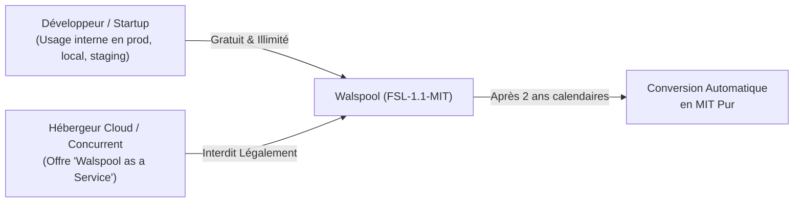
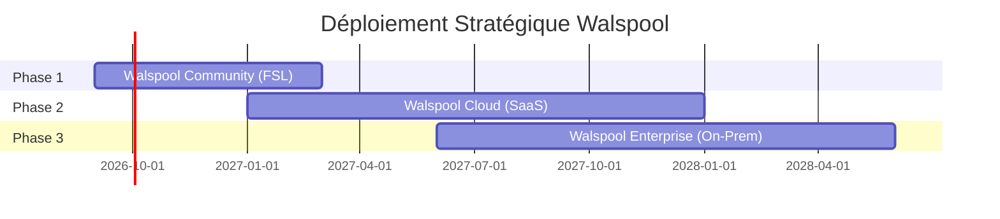
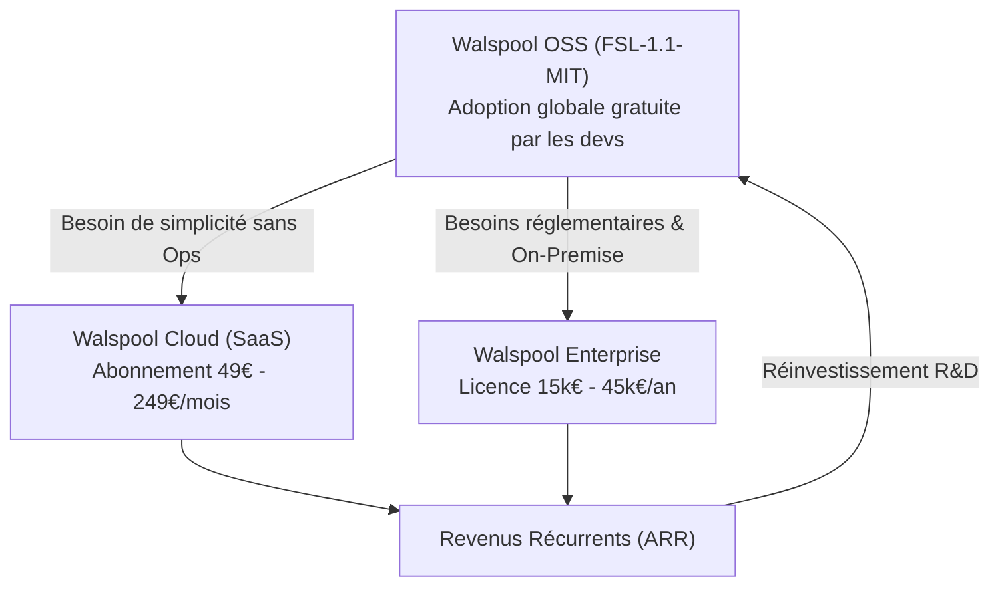

# Walspool — Stratégie Commerciale & Modèle de Monétisation

> **Document Interne Stratégique**  
> **Auteur & Propriétaire Exclusif :** Yohann Hommet  
> **Date de référence :** Septembre 2026  
> **Statut :** Confidentiel / Feuille de Route Fondateur  

---

## 1. Vision Stratégique & Thèse de Marché

### Le Problème du Marché
Dans les architectures distribuées (microservices, IoT, edge, paiements), deux extrêmes coexistent pour la gestion des événements et de la télémétrie :
1. **Les Brokers Lourds (Kafka, RabbitMQ, Redpanda)** : Excellents mais surdimensionnés pour servir de simple tampon local de résilience. Ils nécessitent des clusters, des dizaines de gigaoctets de RAM, des équipes Ops dédiées et coûtent cher en cloud managé (Confluent, AWS MSK).
2. **Les Canaux / Queues en Mémoire (Go channels, Python `asyncio`, Redis in-memory)** : Ultra-rapides mais volatiles. Au moindre crash, redéploiement Kubernetes ou OOM-Killer, **100 % des données non transmises sont irrémédiablement perdues**.

### La Proposition de Valeur Unique de Walspool
Walspool occupe le **« Sweet Spot »** :
- Binaire autonome ultra-léger (~15 Mo, zéro dépendance externe).
- Persistance Write-Ahead Log (WAL) sur disque en microsecondes (1,13M ops/s avec Group Commit 128 Ko et CRC32).
- Hub en mémoire circulaire (Ring Buffer O(1)) avec streaming temps réel Server-Sent Events (SSE) à > 1M req/s.
- **Résilience absolue** : si le collecteur aval tombe en panne ou renvoie du `HTTP 429 Too Many Requests`, Walspool retient les événements sur disque sans perte et les rejoue dès rétablissement.

---

## 2. Doctrine de Licence : Pourquoi la FSL-1.1-MIT ?

Pour éviter l'écueil classique où un hébergeur cloud (AWS, GCP, OVH) ou un concurrent opportuniste s'approprie le logiciel pour le revendre en SaaS sans contribuer au projet, Walspool adopte la **Functional Source License (FSL-1.1-MIT)**.



### Bénéfices de la FSL-1.1-MIT :
1. **Zéro friction pour les utilisateurs finaux** : Toute entreprise peut utiliser, compiler, déployer et modifier Walspool pour ses besoins internes, y compris à grande échelle commerciale, sans payer de royalties.
2. **Protection stricte contre la prédation SaaS** : Seul le titulaire du copyright (**Yohann Hommet**) a le droit légal de proposer un service managé commercial basé sur Walspool.
3. **Pacte de confiance communautaire** : Chaque version publiée bascule irrévocablement sous licence **MIT au bout de 2 ans**. Le code ne peut pas être enfermé arbitrairement.

---

## 3. Matrice des Offres par Phases



---

### Phase 1 : Walspool Community (Adoption & Notoriété)
*Statut : Actif*

- **Objectif** : Générer de l'attraction développeur, des étoiles GitHub, de l'indexation technique et valider le produit sur le terrain.
- **Modèle de distribution** : Open Source / Fair Source (FSL-1.1-MIT) sur GitHub et Docker Hub.
- **Inclus** :
  - Bibliothèque Go officielle (`go get github.com/YohannHommet/walspool`).
  - Image Docker Sidecar minimale non-root (`walspool:latest`).
  - Moteur disque WAL avec Group Commit 128 Ko et intégrité CRC32.
  - Hub in-memory circulaire (50 000 entrées) avec requêtes historiques `/v1/logs`.
  - Diffusion Server-Sent Events (SSE) temps réel `/v1/logs/stream`.
  - Métriques Prometheus `/metrics` et sondes Kubernetes `/healthz`, `/readyz`.
- **Monétisation indirecte** : Inbound marketing, crédibilité technique, missions de conseil en architecture haute performance.

---

### Phase 2 : Walspool Cloud (SaaS Managé)
*Lancement cible : Dès les premiers retours de traction et d'entreprises utilisatrices*

- **Problème résolu** : Beaucoup d'équipes adorent le concept mais ne veulent pas gérer de disques persistants (EBS/PV Kubernetes), dimensionner les volumes NVMe, configurer la rétention long-terme ou maintenir une infrastructure d'alerting.
- **Architecture de l'offre** :
  - Endpoints d'ingestion globaux géo-distribués (`https://ingest.walspool.io/v1/enqueue`).
  - Stockage hiérarchisé (Tiered Storage) : Hot buffer sur NVMe $\to$ archivage froid automatique sur Amazon S3 / Cloudflare R2 au format Parquet/DuckDB pour requêtage analytique illimité.
  - Console Web Cloud multi-tenant : visualiseur de traces interactif, waterfall de latence, flux SSE temps réel consolidé de tous les microservices, recherche full-text.
  - Gestion d'alertes intégrée : notifications directes Slack, PagerDuty, Discord ou Webhook sur spikes d'erreurs ou blocage de downstream sinks.

#### Grille Tarifaire Envisagée (Walspool Cloud) :

| Forfait | Prix Public | Ingestion Mensuelle | Rétention Hot / Cold | Fonctionnalités Clés |
| :--- | :--- | :--- | :--- | :--- |
| **Developer** | **Gratuit** (Freemium) | 5 millions d'événements | 3 jours hot / Pas d'archivage froid | 1 projet, console live SSE, support communauté |
| **Team** | **49 € / mois** | 50 millions d'événements | 14 jours hot / 90 jours S3 | 5 utilisateurs, alertes Slack, métriques 1s |
| **Business** | **249 € / mois** | 500 millions d'événements | 30 jours hot / 1 an S3 | Équipes illimitées, rétention personnalisée, SSO OIDC, support prioritaire 24h |
| **Usage Supplémentaire** | À la consommation | 0,05 € par 100 000 événements excédentaires | — | Facturation à l'usage réelle via Stripe |

---

### Phase 3 : Walspool Enterprise (On-Premise Commercial)
*Lancement cible : Grands comptes, banques, santé, défense, télécoms*

- **Problème résolu** : Les entreprises soumises à de fortes contraintes réglementaires (RGPD strict, HIPAA, SOC2, bancaire) ont l'interdiction formelle d'expédier leurs logs et traces vers un SaaS public tiers. Elles doivent exécuter Walspool dans leur propre infrastructure privée (VPC souverain ou Bare-Metal).
- **Format du produit** : Binaire commercial enrichi `walspool-enterprise` ou licence d'activation annuelle.

#### Fonctionnalités Exclusives Enterprise :
1. **Haute Disponibilité Distribuée (Consensus Raft)** :
   - Réplication synchrone multi-nœuds (3 ou 5 nœuds) pour tolérer la perte d'un serveur physique sans rupture de séquence.
2. **Chiffrement Matériel au Repos (At-Rest Encryption)** :
   - Chiffrement AES-256-GCM des fichiers WAL sur disque avec gestion des clés via HashiCorp Vault, AWS KMS ou Azure Key Vault.
3. **Sécurité d'Entreprise & Contrôle d'Accès** :
   - Authentification SSO SAML 2.0 / Okta / Azure Active Directory sur la console et les flux SSE.
   - mTLS (Mutual TLS) obligatoire entre le sidecar et l'application émettrice.
4. **Connecteurs Analytiques Managés (Enterprise Sinks)** :
   - Adaptateurs de drainage direct haute vitesse vers ClickHouse, Snowflake, Datadog et Splunk avec sémantique *Exactly-Once*.
5. **SLA & Support Dédié** :
   - Contrat de support 24/7, temps de réponse garanti < 2h, assistance directe à l'architecture.

#### Modèle Tarifaire Enterprise :
- Licence par cluster annuel : **15 000 € à 45 000 € / an / cluster**, selon le volume ingéré et le niveau de SLA souscrit.

---

### Phase 4 : L'Écosystème Hybride (L'Effet Volant d'Inertie)



---

## 4. Alignement Architectural avec la Doctrine Black-Box

La monétisation n'exige **aucun fork divergeant ni réécriture complexe**. L'architecture de Walspool a été conçue pour supporter cette transition de manière totalement modulaire :

```text
walspool/
├── ports.go                 <-- CONTRATS INBOUND & OUTBOUND
│   ├── StorageEngine        <-- Interface implémentée par OSS (File) et Enterprise (Raft, KMS)
│   ├── Sink                 <-- Interface implémentée par OSS (HTTP) et Enterprise (ClickHouse, S3)
│   └── IngestionObserver    <-- Port d'interception (MemoryLogHub, AuditTrail)
├── cmd/sidecar/             <-- Binaire communautaire FSL
└── enterprise/ (Privé)      <-- Dépôt privé optionnel
    ├── raft_storage.go      <-- Implémentation propriétaire de StorageEngine
    ├── kms_encryption.go    <-- Wrapper de chiffrement transparent
    └── saml_auth.go         <-- Middleware HTTP d'authentification
```

Toute extension commerciale s'injecte via les constructeurs à options fonctionnelles sans jamais altérer le cœur ouvert.

---

## 5. Gouvernance & Sécurisation de la Propriété Intellectuelle

Pour préserver 100 % de la valeur commerciale future :
1. **DCO (Developer Certificate of Origin)** : Tout commit extérieur requiert la signature `-s` certifiant la légitimité du code soumis et l'adhésion à la FSL-1.1-MIT.
2. **Propriété Exclusve des Droits d'Auteur** : **Yohann Hommet** demeure l'unique titulaire du copyright initial et conserve les droits exclusifs d'exploitation commerciale.
3. **Droit de Marque (Trademark)** : Le nom **Walspool** et le logo en ruban 3D sont réservés. Même sous la clause de réversion MIT à 2 ans, personne ne peut utiliser la marque pour vendre un service concurrent.

---

## 6. Prochaines Étapes Opérationnelles

| Horizon | Action | Responsable |
| :--- | :--- | :--- |
| **Immédiat** | Basculer la licence officielle en `FSL-1.1-MIT` dans le repo | Yohann Hommet |
| **Immédiat** | Publier `CONTRIBUTING.md` avec DCO et politique de marque | Yohann Hommet |
| **Q1 2027** | Lancer la landing page d'attente pour la bêta **Walspool Cloud** | Yohann Hommet |
| **Q2 2027** | Développer le prototype de connecteur S3/Parquet pour le Cloud | Yohann Hommet |
| **Q3 2027** | Initier les premières discussions pilotes Enterprise pour l'adaptateur Raft/KMS | Yohann Hommet |
