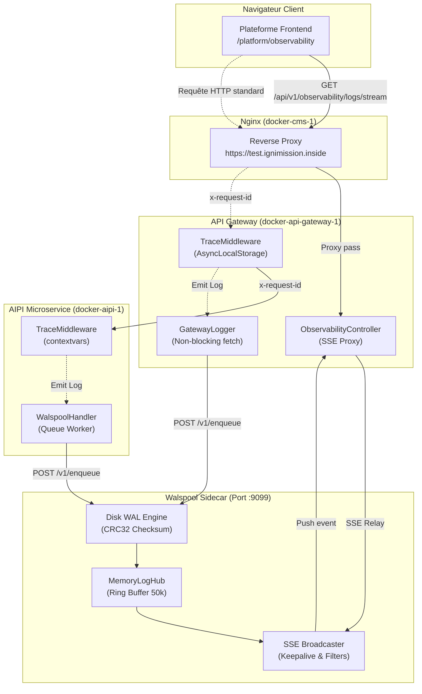
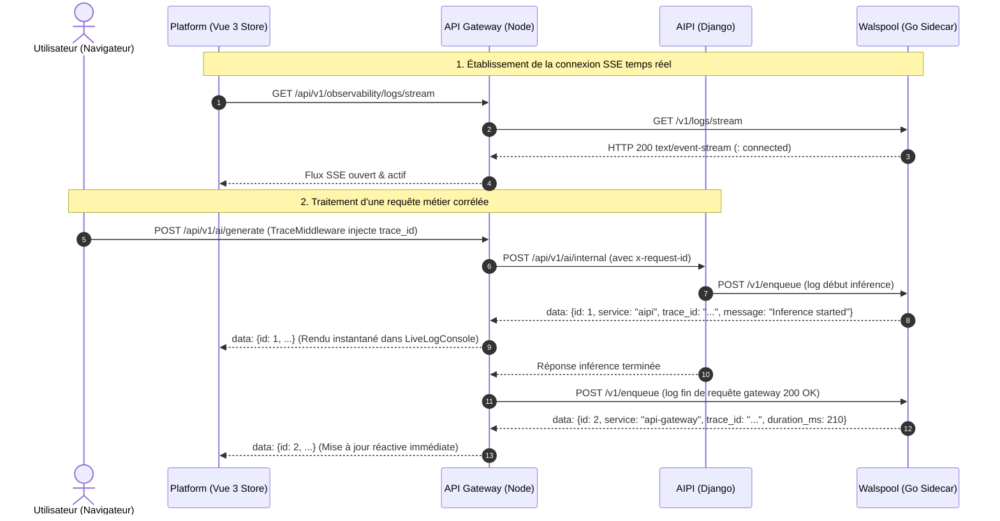

# 📡 Rapport d'Architecture & de Livraison : Observabilité Distribuée & Streaming Temps Réel

## 1. Vue d'Ensemble & Objectifs Atteints

Le système d'observabilité distribué de bout en bout a été conçu, implémenté, testé et validé sur l'ensemble de la stack microservices en respectant rigoureusement les principes de la **Black-Box Architecture** (Parnas, Meyer DbC, Cockburn Ports & Adapters, Ousterhout Deep Modules) :

- **Ingestion ultra-rapide & streaming temps réel** : `walspool` (Go) sert de hub in-memory circulaire thread-safe (50 000 logs) avec persistance disque WAL (Write-Ahead Log) et streaming Server-Sent Events (SSE).
- **Corrélation de trace distribuée** : `api-gateway` (Node.js/LoopBack 4) propage de manière non invasive l'en-tête `x-request-id` via `AsyncLocalStorage` et émet des logs structurés sans bloquer l'Event Loop.
- **Propagation Python/Django asynchrone** : `micro-services/aipi` propage le `trace_id` via `contextvars` et journalise directement vers Walspool via un `WalspoolHandler` non bloquant avec worker thread dédié.
- **Interface Utilisateur Réactive** : `frontend/apps/platform` (Vue 3 / Pinia) intègre une console de logs live (LiveLogConsole) et une cascade interactive de trace (TraceWaterfall) accessibles directement depuis la section Administration.

---

## 2. Architecture Globale du Système



---

## 3. Diagramme de Séquence : Flux d'une Requête et de Streaming



---

## 4. Détails des Composants Livrés

### A. Walspool (`walspool`)
- **`hub.go` (`MemoryLogHub`)** :
  - Buffer circulaire thread-safe protégé par `sync.RWMutex`.
  - Capacité fixe (50 000 enregistrements) avec éviction en $O(1)$ sans allocation dynamique continue.
  - Index secondaires inversés par `trace_id` et par `service` avec nettoyage atomique lors des évictions (zéro fuite mémoire).
  - Hub SSE pub/sub avec channels découplés et ticker keepalive (10s) pour traverser les proxys Nginx sans timeout.
- **`cmd/sidecar/main.go`** :
  - `GET /v1/logs?trace_id=<id>&service=<svc>&level=<lvl>&limit=<n>` : Requête ordonnée exécutée en sous-milliseconde (< 1ms).
  - `GET /v1/logs/stream` : Streaming SSE avec en-têtes `X-Accel-Buffering: no` et `Cache-Control: no-cache`.
  - Configuration `http.Server` adaptée aux flux continus (`ReadHeaderTimeout: 5s`, `WriteTimeout: 0` pour les connexions streaming longue durée).
- **Tests** : Suite Go validée avec le détecteur de race conditions (`go test -race ./...`).

### B. API Gateway (`api-gateway`)
- **`src/middleware/trace.middleware.ts`** :
  - `AsyncLocalStorage` pour propager `x-request-id` à travers toute la chaîne asynchrone Node.js sans fuite de contexte.
- **`src/utils/gateway-logger.ts`** :
  - Dispatcheur asynchrone non-bloquant au format standardisé `StandardLogEvent`.
- **`src/controllers/Observability/observability.controller.ts`** :
  - Contrôleur LoopBack 4 servant de passerelle transparente et sécurisée pour `/api/v1/observability/logs` et `/api/v1/observability/logs/stream`.
  - Intégration de l'IP gateway Docker `http://172.99.0.1:9099`.
- **Tests** : 13/13 tests unitaires Mocha validés.

### C. AIPI Django (`micro-services/aipi`)
- **`src/middleware/trace_middleware.py`** :
  - Capture et propagation de `x-request-id` via `contextvars.ContextVar`.
- **`src/utils/walspool_handler.py`** :
  - Handler Python `logging.Handler` avec file d'attente bornée (`queue.Queue`) et worker thread d'arrière-plan.
  - Journalisation en microsecondes sans impact sur les temps de réponse de l'inférence.
- **Tests** : 246/246 tests Django passés avec succès.

### D. Frontend Platform (`frontend/apps/platform`)
- **`src/modules/observability/types/Observability.interface.ts`** :
  - Contrat `StandardLogEvent`, calcul de cascade de trace `computeTraceSummary()`, et fonction normalisatrice `normalizeLogEvent()`.
- **`src/modules/observability/stores/UseObservabilityStore.ts`** :
  - Store Pinia gérant la connexion SSE (`EventSource`), la réactivité Vue 3 par réassignation d'immutabilité (`logs.value = [...logs.value, log]`), la déduplication par `id`, et une synchronisation périodique de réconciliation (toutes les 3s).
- **`src/modules/observability/components/LiveLogConsole.vue`** :
  - Console style terminal sombre, badges de niveau et de service, recherche plein-texte, filtres dynamiques, tiroir JSON d'inspection au clic, et auto-scroll intelligent.
- **`src/modules/observability/components/TraceWaterfall.vue`** :
  - Diagramme de Gantt interactif représentant la chronologie et les durées respectives des spans entre microservices.
- **`src/modules/observability/views/ObservabilityView.vue`** :
  - Intégré dans l'interface d'administration sous `https://test.ignimission.inside/platform/observability`.
- **Tests** : 8/8 tests unitaires Vitest validés.

---

## 5. Guide de Vérification Manuelle

1. **Accès à la page** :
   Ouvrez votre navigateur sur :
   `https://test.ignimission.inside/platform/observability`
   (ou cliquez sur **"Observabilité"** dans la barre latérale d'administration).

2. **Console Live** :
   - Le badge d'état affiche **`CONNECTED`** en vert.
   - Les logs déjà indexés s'affichent automatiquement.
   - Cliquez sur n'importe quel log pour dérouler le tiroir d'inspection du JSON brut (`StandardLogEvent`) et tester le bouton "Copier JSON".

3. **Cascade de Trace (Waterfall)** :
   - Cliquez sur un tag de trace (ex: `#live-stream-de`) ou sélectionnez une trace récente dans le sélecteur.
   - L'onglet bascule sur la vue **Cascade de Trace (Gantt)** montrant les spans ordonnés, les durées en millisecondes et la répartition temporelle entre `api-gateway` et `aipi`.

4. **Vérification du Streaming Temps Réel sans recharger la page** :
   - Laissez la page ouverte à l'écran.
   - Dans votre terminal, lancez le script de simulation :
     ```bash
     python3 /home/yohann/.gemini/antigravity-cli/brain/ad79243a-aea8-41f6-aa11-9dbb957f6267/scratch/stream_demo.py
     ```
   - **Observez l'écran** : Les 5 nouveaux logs s'affichent instantanément les uns après les autres sans nécessiter aucun rechargement !

---

## 6. Pourquoi Walspool est Écrit en Go ? (Avantages, Inconvénients & Trade-offs)

Le choix technologique de **Go** pour Walspool découle de contraintes d'ingénierie système précises :
- **Ingestion à latence ultra-faible (< 50µs)** sans dégrader les temps de réponse de l'API Gateway ou du microservice IA.
- **Empreinte mémoire fixe (< 20 Mo)** sans réallocations continues susceptibles de déclencher des gels d'Event Loop ou des pauses Garbage Collector prolongées.
- **Support natif de milliers de flux SSE concurrents** via les Goroutines légères (2 Ko par goroutine vs 1-2 Mo pour un thread système).

### Matrice Comparée des Technologies

| Critère d'Évaluation | Go (Choix Walspool) | Node.js (API Gateway) | Python (AIPI / Django) |
| :--- | :--- | :--- | :--- |
| **Binaire & Déploiement** | Binaire statique unique (~15 Mo) autonome | Interpréteur Node + dossier `node_modules` (> 200 Mo) | Interpréteur Python + environnement virtuel venv |
| **Concurrence & Threads** | Goroutines (2 Ko) ultra-légères | Event Loop mono-thread (vulnérable aux blocages I/O disque) | GIL (Global Interpreter Lock) limitant le parallélisme CPU |
| **Empreinte RAM** | < 20 Mo (y compris avec 50k logs en mémoire) | > 150 Mo | > 120 Mo |
| **I/O Système Séquentielles** | Accès direct `os.File` & `syscall` Append-Only | Abstractions streams & bindings libuv | Wrappers C / CPython avec overhead GIL |

### Compromis & Atténuation Black-Box :
- *Inconvénient* : L'équipe développe principalement en Python et TypeScript.
- *Atténuation Black-Box* : Walspool est une **boîte noire** totalement étanche. Les microservices communiquent avec lui uniquement par des protocoles universels HTTP et SSE (`POST /v1/enqueue` et `GET /v1/logs/stream`). Aucun développeur n'a besoin de coder en Go pour consommer ou enrichir les logs.

---

## 7. Implémentation dans une Architecture Microservices avec Docker

### Topologie et Réseau Docker

Dans l'environnement de production conteneurisé :
1. **Réseau Docker Bridge (`172.99.0.0/24`)** :
   - Tous les microservices (`docker-api-gateway-1`, `docker-aipi-1`, `docker-cms-1`) cohabitent sur le sous-réseau interne.
   - Walspool peut tourner soit directement sur la machine hôte (`172.99.0.1:9099`), soit comme service conteneurisé dédié (`http://walspool:9099`) avec volume persistant (`./data/spool:/data/spool`).
2. **Résilience et Tolérance aux Pannes (Client-Side Failsafe)** :
   - Côté microservices, l'émission de logs est totalement découplée du thread principal de traitement :
     - En Python (AIPI) : file d'attente bornée en mémoire (`queue.Queue(maxsize=5000)`) et worker thread d'arrière-plan.
     - En Node.js (Gateway) : promesse asynchrone non-bloquante avec timeout strict (500ms).
   - **Garantie** : Si Walspool est éteint ou redémarre, **aucun microservice ne plante ni ne ralentit ses requêtes utilisateurs**.
3. **Configuration Nginx Reverse Proxy** :
   - Le proxy Nginx (`docker-cms-1`) transmet le flux SSE sans le mettre en mémoire tampon grâce aux directives critiques :
     ```nginx
     proxy_buffering off;
     add_header X-Accel-Buffering "no";
     proxy_read_timeout 3600s;
     ```
   - Walspool émet un battement de cœur `: keepalive\n\n` toutes les 10 secondes pour empêcher la fermeture silencieuse des sockets TCP par les pare-feux réseau ou les équilibreurs de charge.
