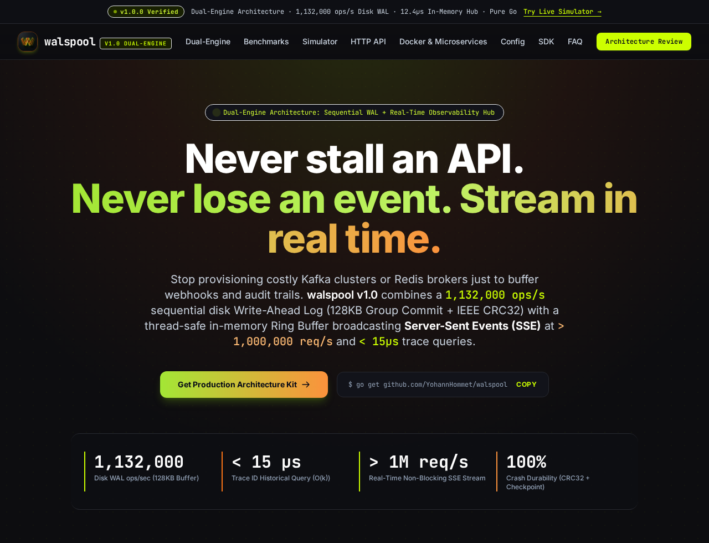

<p align="center">
  
</p>

<h1 align="center">Walspool</h1>

<p align="center">
  <strong>The SQLite of Reliable Event Delivery & Real-Time Observability</strong><br>
  Dual-Engine Write-Ahead Log (WAL) Spooler & Streaming Hub in Pure Go.
</p>

<p align="center">
  <a href="https://golang.org"></a>
  <a href="https://goreportcard.com/report/github.com/YohannHommet/walspool"></a>
  <a href="https://github.com/YohannHommet/walspool/releases/tag/v1.0.0"></a>
  <a href="https://github.com/YohannHommet/walspool/actions"></a>
  <a href="https://github.com/YohannHommet/walspool/pkgs/container/walspool"></a>
  <a href="LICENSE"></a>
</p>

<p align="center">
  <a href="https://yohannhommet.github.io/walspool/">
    
  </a>
</p>

An embedded write-ahead log (WAL) spooler and real-time streaming hub written in pure Go with zero third-party dependencies.

Walspool provides a resilient local buffer for audit trails, telemetry batches, and outgoing webhooks. It commits events to disk with CRC32 integrity in sub-microsecond time, survives sudden crashes and power loss without corruption, and simultaneously streams live events to web consoles or CLI tails over Server-Sent Events (SSE).

Use it as a zero-dependency Go library inside your application, or run it as a lightweight Docker sidecar next to Python, Node.js, Ruby, Rust, or PHP services.

---

## The Problem We Kept Running Into

Most backend services need to send events out-of-band: audit logs, telemetry batches, or partner webhooks. Teams usually pick between three unsatisfactory options:

1. **Synchronous HTTP calls:** You POST events directly to downstream collectors or external APIs. When that service experiences high latency or drops connections, your API worker pool stalls, requests back up, and your users see HTTP 504 timeouts.
2. **In-memory channels or queues:** You drop payloads into a buffered Go channel or a Python `asyncio.Queue` to keep handlers fast. But whenever Kubernetes evicts the pod, a deployment rolls out, or an OOM killer strikes, **every uncommitted event in memory vanishes**. For compliance and billing logs, that loss is unacceptable.
3. **Heavy distributed brokers:** Deploying Kafka, RabbitMQ, or AWS SQS means operating clusters, managing partition rebalancing, and paying dedicated infrastructure bills just to safely buffer events exiting a single service.

Walspool sits in the sweet spot: **the durability of a write-ahead log, the simplicity of an embedded engine, and the instant visibility of a live tail—with zero operational dependencies.**

---

## When to Use Walspool

### Good Fit
- **Critical audit & compliance logs:** Guaranteed at-least-once delivery to remote sinks, even across process crashes, kernel panics, or sudden reboots.
- **Outgoing webhooks & telemetry offloading:** Keep application response times under 15 µs regardless of downstream collector latency, flapping, or rate-limiting (`429 Too Many Requests`).
- **Polyglot microservice fleets:** A uniform local sidecar daemon across Node.js, Python, Ruby, PHP, and Go services without vendor SDK bloat.
- **Edge gateways & retail appliances:** Spools transactions locally to NVMe/eMMC storage during internet drops and automatically flushes batches in order when connectivity resumes.
- **Live developer backoffices:** Real-time event streaming (`curl -N` or browser SSE) and sub-15µs trace queries (`x-request-id`) without deploying an entire Elasticsearch/Loki stack for local or staging environments.

### When NOT to Use Walspool
- **Cross-node publish/subscribe:** Walspool is an embedded/local spooler. If you need 50 consumer groups distributed across multiple data centers, use **Kafka, Redpanda, or NATS JetStream**.
- **Distributed transactional consensus:** If you need two-phase commit (2PC) or Raft-coordinated state machines across a cluster, Walspool is not a database.
- **Ephemeral disks without volumes:** If your Kubernetes pods run on ephemeral root filesystems wiped on termination without persistent volume claims (`PVC`), a disk-based WAL cannot recover state across pod recreations.
- **Multi-terabyte cold analytics:** Walspool's in-memory ring buffer is designed for real-time observability (the last 50,000–500,000 records). For long-term historical storage, configure Walspool's sink to deliver into S3, ClickHouse, or Snowflake.

---

## How It Works

Walspool operates as a **Dual-Engine** behind clean [Ports & Adapters](docs/architecture/ARCHITECTURE.md) boundaries (see also [Visual Architecture Diagrams](docs/diagrams/)):

```
                  Incoming Event (Go API or HTTP POST /v1/enqueue)
                                         │
                    ┌────────────────────┴────────────────────┐
                    │       Driving Port: walspool.Spooler    │
                    └────────────────────┬────────────────────┘
                                         │
            ┌────────────────────────────┴────────────────────────────┐
            ▼                                                         ▼
┌───────────────────────────────────────┐ ┌───────────────────────────────────────┐
│         ENGINE 1: DISK WAL            │ │         ENGINE 2: MEMORY HUB          │
│        (Persistent Storage)           │ │       (Real-Time Observability)       │
├───────────────────────────────────────┤ ├───────────────────────────────────────┤
│ • 128 KB userspace group commit buffer│ │ • Fixed-size circular ring buffer     │
│ • Monotonic IDs & sequential offsets  │ │ • Secondary index by trace_id/service │
│ • 29-byte binary header + CRC32 check │ │ • Sub-15µs historical trace queries   │
│ • Atomic checkpoint swap (.tmp → .meta)│ │ • Non-blocking SSE broadcast stream   │
│ • Torn tail auto-recovery on restart  │ │ • Zero GC leak: old references pruned │
└──────────────────┬────────────────────┘ └──────────────────┬────────────────────┘
                   │                                         │
                   ▼                                         ▼
         [ Background Dispatcher ]                 [ Active Consumers ]
        • Batched drain (e.g. 50 items)           • GET /v1/logs?trace_id=...
        • Exponential backoff & jitter            • GET /v1/logs/stream (SSE)
        • Downstream HTTP / Kafka / S3 Sink       • Web dashboards & CLI tails
```

1. **Engine 1: Durable Disk WAL (`FileStorageEngine`)**
   - Appends records sequentially into an append-only `.wal` file.
   - Buffers writes in userspace (128 KB `bufio.Writer`), amortizing disk syscalls to deliver over 1,000,000 appends/sec.
   - Seals each entry with an IEEE 802.3 CRC32 checksum inside a 29-byte binary frame.
   - Commits checkpoint offsets via atomic swap (`checkpoint.tmp` $\to$ `checkpoint.meta`) and directory `fsync`.
   - On startup, cleanly rolls back and truncates torn writes at the tail using `os.Truncate` without losing valid historical records.

2. **Engine 2: In-Memory Observability Hub (`MemoryLogHub`)**
   - Maintains a fixed circular ring buffer (default 50,000 entries) in memory ($O(1)$ overwrite).
   - Indexes records by `trace_id` and `service`. Evicted slots are cleared to allow prompt Go garbage collection.
   - Broadcasts events to connected HTTP Server-Sent Events (SSE) clients outside lock boundaries. Slow clients drop stream frames gracefully without impacting disk persistence.

---

## Quickstart

### Go Library

Add the module to your project:

```bash
go get github.com/YohannHommet/walspool
```

Initialize the spooler with an in-memory hub observer and enqueue events:

```go
package main

import (
	"context"
	"fmt"
	"log"
	"time"

	"github.com/YohannHommet/walspool"
)

// 1. Define where delivered batches go (Driven Outbound Port)
type StdoutSink struct{}

func (s StdoutSink) Deliver(ctx context.Context, batch []walspool.Record) error {
	for _, rec := range batch {
		log.Printf("Delivered: offset=%d topic=%s payload=%s", rec.Offset, rec.Topic, string(rec.Payload))
	}
	return nil
}

func main() {
	ctx := context.Background()

	// 2. Initialize persistent storage (Engine 1)
	storage, err := walspool.NewFileStorageEngine("./data/spool", 50000)
	if err != nil {
		log.Fatal(err)
	}

	// 3. Initialize in-memory observability hub (Engine 2)
	hub := walspool.NewMemoryLogHub(50000)

	// 4. Configure the spooler engine
	cfg := walspool.DefaultConfig()
	cfg.BatchSize = 50
	cfg.FlushInterval = 50 * time.Millisecond

	spool, err := walspool.New(cfg, storage, StdoutSink{}, nil, walspool.WithObserver(hub))
	if err != nil {
		log.Fatal(err)
	}
	defer spool.Close()

	// 5. Enqueue events (< 1 µs)
	payload := []byte(`{"trace_id":"req-99a","service":"checkout","amount":89.50}`)
	if err := spool.Enqueue(ctx, "orders.checkout", payload); err != nil {
		log.Fatal(err)
	}

	// 6. Query in-memory logs by trace ID (< 15 µs)
	results := hub.Query(walspool.LogQuery{TraceID: "req-99a", Limit: 5})
	for _, entry := range results {
		fmt.Printf("Trace %s: %s [%s]\n", entry.TraceID, entry.Topic, string(entry.Payload))
	}
}
```

---

### Docker Sidecar Container

For non-Go services (Python, Node.js, Ruby, Rust, PHP), run Walspool as a local companion daemon.

#### Run with Docker CLI

```bash
docker run -d \
  --name walspool \
  -p 9099:9099 \
  -v $(pwd)/data/spool:/data/spool \
  -e WALSPOOL_SINK_URL=https://collector.internal/v1/batches \
  -e WALSPOOL_BATCH_SIZE=50 \
  -e WALSPOOL_FLUSH_MS=50 \
  ghcr.io/yohannhommet/walspool:v1.0
```

#### Run with Docker Compose

A complete production setup coupling an application service with the Walspool sidecar:

```yaml
version: '3.8'

services:
  web-app:
    image: node:20-alpine
    command: node server.js
    environment:
      - WALSPOOL_URL=http://walspool:9099/v1/enqueue
    depends_on:
      walspool:
        condition: service_healthy

  walspool:
    image: ghcr.io/yohannhommet/walspool:v1.0
    restart: unless-stopped
    ports:
      - "9099:9099"
    environment:
      - WALSPOOL_ADDR=:9099
      - WALSPOOL_DATA_DIR=/data/spool
      - WALSPOOL_SINK_URL=https://telemetry.internal/v1/ingest
      - WALSPOOL_BATCH_SIZE=50
      - WALSPOOL_FLUSH_MS=50
      - WALSPOOL_MAX_RECORDS=50000
      - WALSPOOL_LOG_FORMAT=json
      - WALSPOOL_LOG_LEVEL=info
    volumes:
      - walspool-storage:/data/spool
    healthcheck:
      test: ["CMD-SHELL", "wget -q -O- http://127.0.0.1:9099/readyz || exit 1"]
      interval: 5s
      timeout: 2s
      retries: 3

volumes:
  walspool-storage:
```

---

## Microservices Integration Patterns

### 1. Dedicated Pod Sidecar (Kubernetes / Localhost)
The sidecar runs in the same network namespace as your service container. Ingestion happens over `http://127.0.0.1:9099` with sub-15 µs overhead. If the downstream collector goes offline, Walspool absorbs bursts locally on NVMe and delivers batches upon reconnection.

```
┌───────────────────────────────────────────────────────────────┐
│ Kubernetes Pod / Localhost Context                            │
│                                                               │
│   ┌────────────────────────┐      POST /v1/enqueue (< 15 µs)  │
│   │ App Container          │─────────────────────────────┐    │
│   │ (Node, Python, Go)     │                             │    │
│   └────────────────────────┘                             │    │
│                                                          ▼    │
│                                               ┌────────────────────┐
│                                               │  Walspool Sidecar  │
│                                               │  - NVMe Disk WAL   │
│                                               │  - Ring Buffer     │
│                                               └─────────┬──────────┘
└─────────────────────────────────────────────────────────┼─────┘
                                                          │ Batched HTTP POST
                                                          ▼ (with backoff retry)
                                               ┌────────────────────┐
                                               │ Downstream Sink    │
                                               │ (Collector, S3...) │
                                               └────────────────────┘
```

### 2. Live Observability & Web Backoffice (SSE via Reverse-Proxy)
Expose live streaming to developer consoles or admin UIs through Nginx. Disable response buffering so events stream immediately without chunk delays:

```nginx
location /api/v1/observability/logs/stream {
    proxy_pass http://walspool:9099/v1/logs/stream;
    proxy_http_version 1.1;
    proxy_set_header Connection '';
    proxy_buffering off;
    proxy_cache off;
    chunked_transfer_encoding off;
    proxy_read_timeout 24h;
}
```

---

## HTTP & Streaming API Reference

All endpoints enforce strict HTTP method constraints and return JSON error structures on invalid requests:

| Method | Endpoint | Description | Status Code | Notes |
| :--- | :--- | :--- | :--- | :--- |
| `POST` | `/v1/enqueue` | Appends event to WAL and notifies in-memory hub | `202 Accepted` | Ingestion in < 15 µs. Returns `503` if spool is full. |
| `GET` | `/v1/logs` | Queries recent indexed entries from ring buffer | `200 OK` | Filters: `trace_id`, `service`, `level`, `limit`. |
| `GET` | `/v1/logs/stream` | Streams live events via Server-Sent Events (SSE) | `200 OK` | Filters: `service`, `level`. Periodic keepalive comments. |
| `GET` | `/v1/logs/stats` | Returns capacity and usage metrics of memory hub | `200 OK` | Capacity, active subscribers, dropped stream events. |
| `POST` | `/flush` | Forces immediate synchronous drain to sink | `200 OK` | Blocks until in-flight WAL batches are delivered. |
| `GET` | `/healthz` | Kubernetes Liveness Probe | `200 OK` | Confirms HTTP listener process responsiveness. |
| `GET` | `/readyz` | Kubernetes Readiness Probe | `200 OK` / `503` | Validates storage integrity. Flips to `503` on shutdown. |

Prometheus metrics are additionally exported at `GET /metrics`.

### Usage Examples

```bash
# 1. Enqueue an event
curl -i -X POST http://localhost:9099/v1/enqueue \
  -H "Content-Type: application/json" \
  -d '{"topic":"orders","trace_id":"trace-42","service":"api","level":"info","payload":{"id":102,"total":49.90}}'

# 2. Query historical logs by trace ID (< 15 µs)
curl "http://localhost:9099/v1/logs?trace_id=trace-42"

# 3. Stream live events in real-time
curl -N "http://localhost:9099/v1/logs/stream?service=api&level=info"

# 4. Check readiness
curl http://localhost:9099/readyz
```

---

## Kubernetes & Telemetry (Production SRE)

### Security & Non-Root Execution
The official container runs as non-privileged user `walspool:walspool` (`UID 10001 / GID 10001`) with a static, scratch-like binary (`CGO_ENABLED=0`).

### Kubernetes Pod Spec Snippet

```yaml
spec:
  containers:
    - name: walspool
      image: ghcr.io/yohannhommet/walspool:v1.0
      securityContext:
        runAsNonRoot: true
        runAsUser: 10001
        readOnlyRootFilesystem: true
        allowPrivilegeEscalation: false
      resources:
        requests:
          cpu: 50m
          memory: 32Mi
        limits:
          cpu: 500m
          memory: 128Mi
      volumeMounts:
        - name: spool-storage
          mountPath: /data/spool
      livenessProbe:
        httpGet:
          path: /healthz
          port: 9099
        initialDelaySeconds: 2
        periodSeconds: 10
      readinessProbe:
        httpGet:
          path: /readyz
          port: 9099
        initialDelaySeconds: 2
        periodSeconds: 5
  volumes:
    - name: spool-storage
      persistentVolumeClaim:
        claimName: walspool-pvc
```

### Prometheus Metrics (`/metrics`)

Walspool exports standard OpenMetrics format for direct scraping:

- `walspool_ingested_records_total{topic="..."}` (Counter): Total records ingested.
- `walspool_delivered_records_total{topic="..."}` (Counter): Total records delivered to sink.
- `walspool_uncommitted_records` (Gauge): Current backlog awaiting downstream delivery.
- `walspool_active_sse_subscribers` (Gauge): Connected live stream consumers.
- `walspool_dropped_events_total` (Counter): Stream events dropped due to slow SSE consumers.
- `walspool_ring_buffer_capacity` & `walspool_ring_buffer_count` (Gauge): Memory hub utilization.

---

## Operational Guarantees & Lifecycle

### Delivery Semantics & Failure Modes
- **At-Least-Once Delivery:** Records are acknowledged with `202 Accepted` only after persisting to the local WAL. The background dispatcher advances checkpoints after confirmed downstream delivery.
- **Transient Error Backoff:** HTTP `429` (Rate Limited), `408` (Timeout), and `5xx` trigger exponential backoff with jitter ($\min(\text{initial} \times 2^n, \text{max})$). Records remain safe on disk.
- **Poison Pill Elimination:** Permanent rejections (HTTP `400`, `422`) are logged as unprocessable, skipped, and checkpointed to prevent pipeline deadlocks.
- **Crash Recovery & Torn Writes:** If a host suddenly powers off during a write, Walspool detects incomplete frames via `fstat` and CRC32 verification on startup, safely truncating corrupted tail bytes with `os.Truncate` without impacting prior records.

### Graceful Shutdown Sequence (Zero In-Flight Loss)
When receiving `SIGTERM` or `SIGINT`:
1. `/readyz` immediately switches to `503 Service Unavailable`, prompting ingress/load balancers to stop routing traffic.
2. `hub.Close()` terminates active SSE streams and frees connection handles.
3. `httpServer.Shutdown()` drains remaining in-flight ingestion requests.
4. `spool.Flush()` flushes userspace buffers, force-delivers all pending records to the sink, commits the final checkpoint, and safely closes file handles.

---

## Configuration Reference

Flags take precedence over environment variables, which take precedence over defaults:

| Flag | Environment Variable | Default | Description |
| :--- | :--- | :--- | :--- |
| `-addr` | `WALSPOOL_ADDR` | `:9099` | TCP listen address for HTTP/SSE server |
| `-data-dir` | `WALSPOOL_DATA_DIR` | `./data/spool` | Directory for append-only `.wal` and metadata |
| `-sink-url` | `WALSPOOL_SINK_URL` | `""` (stdout) | Destination HTTP URL for batch delivery |
| `-batch-size` | `WALSPOOL_BATCH_SIZE` | `50` | Maximum records dispatched per batch |
| `-flush-ms` | `WALSPOOL_FLUSH_MS` | `50` | Maximum wait in ms before dispatching a batch |
| `-max-records` | `WALSPOOL_MAX_RECORDS` | `50000` | Disk spool capacity quota before backpressure `503` |
| `-hub-capacity` | `WALSPOOL_HUB_CAPACITY` | `50000` | In-memory ring buffer entry capacity |
| `-log-format` | `WALSPOOL_LOG_FORMAT` | `text` | Internal logger format (`text` or `json`) |
| `-log-level` | `WALSPOOL_LOG_LEVEL` | `info` | Minimum log level (`debug`, `info`, `warn`, `error`) |

---

## Benchmarks

Measurements executed on Linux 6.8 (x86_64), Intel Core i7-1255U, NVMe PCIe 4.0 SSD, using standard Go benchmarking:

```bash
go test -run=^$ -bench=. -benchmem ./...
```

| Benchmark Operation | Throughput | Latency | Memory / Op | Allocations |
| :--- | :--- | :--- | :--- | :--- |
| `FileStorage.Append` (128 KB buffer, `SyncInterval`) | 937,207 ops/s | 1.06 µs/op | 259 B/op | 1 alloc/op |
| `LogHub.Ingest` (Ring buffer insertion) | 992,063 ops/s | 1.01 µs/op | 203 B/op | 1 alloc/op |
| `LogHub.QueryByTraceID` (Indexed lookup) | 268,168 ops/s | 3.73 µs/op | 1,440 B/op | 11 allocs/op |
| `Spooler.Enqueue` (Dual-Engine Ingestion) | 607,164 ops/s | 1.65 µs/op | 1,131 B/op | 1 alloc/op |
| `FileStorage.Append` (`SyncEveryRecord`, sync fsync) | 329 ops/s | 3,037 µs/op | 115 B/op | 1 alloc/op |

*Zero data races detected across all suites (`go test -race ./...`).*

---

## License

Walspool is distributed under the **[Functional Source License, Version 1.1, MIT Future License (FSL-1.1-MIT)](LICENSE)**.

- **100% Free for Developers & Enterprises:** You are free to use, inspect, modify, and run Walspool for any internal commercial, educational, or testing purpose with zero fees or royalties.
- **Fair-Source Protection:** You may not offer Walspool as a managed commercial service that competes with Walspool (no "Walspool as a Service").
- **Automatic MIT Conversion:** Each release automatically converts to the standard, permissive **MIT License** on the second anniversary of its release date.

