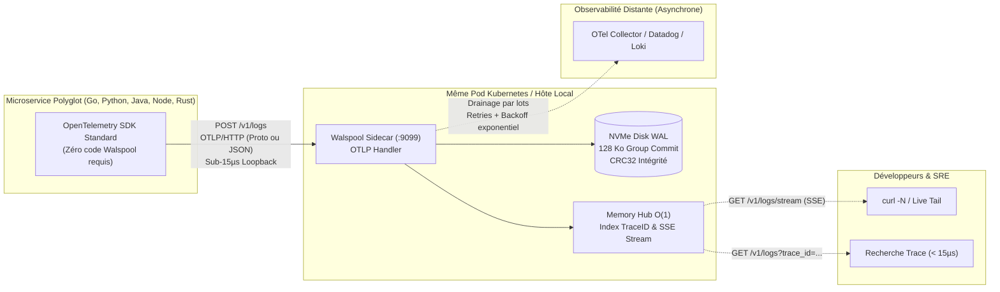

# 📡 OpenTelemetry (OTLP) Native Ingestion Guide

> **Walspool Community Edition**  
> **Package :** `github.com/YohannHommet/walspool`  
> **Status :** Production Ready (v1.1.0+)  
> **License :** FSL-1.1-MIT  
> **Vendor :** [Meow Labs](https://meowlabs.tech)

Walspool Community features native, zero-dependency ingestion for the **OpenTelemetry Protocol (OTLP/HTTP)** on `POST /v1/logs`.

It functions as **The Local OTLP Shock Absorber**: microservices stream telemetry into Walspool on `localhost` in sub-15 µs. If downstream collectors (OpenTelemetry Collector, Datadog, Grafana Loki, ClickHouse) experience latency spikes, rate limits (`429 Too Many Requests`), or network partitions, Walspool persists records to an append-only NVMe Write-Ahead Log (WAL) with CRC32 checksums and drains them asynchronously once connectivity recovers.

---

## 1. Architecture Overview



### Bénéfices Clés
1. **Adoption en Zéro Ligne de Code** : Vos microservices utilisent les exportateurs standards OpenTelemetry (`OTEL_EXPORTER_OTLP_LOGS_ENDPOINT="http://localhost:9099/v1/logs"`).
2. **Protection Anti-Panne (At-Least-Once)** : Aucune perte de journaux d'audit ou de télémétrie si votre réseau ou votre collecteur centralisé tombe.
3. **Observabilité Instantanée** : Live tail immédiat via Server-Sent Events (`/v1/logs/stream`) sans attendre l'ingestion dans votre stack distante.
4. **Ultra-Haute Performance** : Plus de 30 000 requêtes OTLP/s par cœur CPU (~32 µs par requête HTTP complète avec persistance disque et indexation mémoire).

---

## 2. Spécification de l'API OTLP (`POST /v1/logs`)

### En-têtes HTTP
| En-tête | Valeur requise | Description |
| :--- | :--- | :--- |
| `Content-Type` | `application/x-protobuf` ou `application/json` | Format du payload OTLP standard v1. |

### Codes de Réponse
* **`200 OK`** : Enregistrements commités sur le WAL NVMe et indexés dans le hub mémoire.
  * Réponse binaire Protobuf : `ExportLogsServiceResponse` (`{}`).
  * Réponse JSON : `{}`.
* **`400 Bad Request`** : Données corrompues ou syntaxe JSON / Protobuf invalide.
* **`415 Unsupported Media Type`** : Type de contenu non supporté (seuls JSON et Protobuf sont acceptés).
* **`503 Service Unavailable`** : Capacité maximale atteinte (`ErrSpoolFull`).  
  Comprend l'en-tête standard **`Retry-After: 1`** ordonnant au client OpenTelemetry de ralentir.

### Règles de Mapping & Extraction

| Champ OTLP | Cible Walspool | Comportement |
| :--- | :--- | :--- |
| `resource.attributes["service.name"]` | `Topic` & `Service` | Identifie le microservice émetteur. Fallback sur `otel-default-topic` (par défaut `otel_logs`). |
| `logRecord.time_unix_nano` | `Timestamp` | Horodatage nanoseconde de l'événement. Si `0`, utilise `time.Now()`. |
| `logRecord.trace_id` (16 bytes / 32 hex) | `TraceID` | Transcodé en hexadécimal et indexé instantanément dans `MemoryLogHub` pour `GET /v1/logs?trace_id=...`. |
| `logRecord.span_id` (8 bytes / 16 hex) | `SpanID` | Transcodé en hexadécimal et conservé dans le payload JSON. |
| `logRecord.severity_number` / `severity_text` | `Level` | Mappé automatiquement sur `DEBUG`, `INFO`, `WARN`, `ERROR`, ou `FATAL`. |
| `logRecord.body` | `Body` | Extrait sous forme de chaîne ou d'objet structuré dans le payload normalisé. |
| `logRecord.attributes` | `Attributes` | Map clé/valeur préservée au format JSON. |
| `scope.name` | `Scope` | Nom du logger ou de la bibliothèque émettrice. |

---

## 3. Exemples d'Utilisation Polyglotte

### 3.1. Go (avec `log/slog` et OpenTelemetry)

Sans modifier votre logique métier, branchez le pont `slog` vers l'exportateur OTLP HTTP :

```go
package main

import (
	"context"
	"log/slog"
	"time"

	"go.opentelemetry.io/contrib/bridges/otelslog"
	"go.opentelemetry.io/otel/exporters/otlp/otlplog/otlploghttp"
	"go.opentelemetry.io/otel/sdk/log"
	"go.opentelemetry.io/otel/sdk/resource"
	semconv "go.opentelemetry.io/otel/semconv/v1.26.0"
)

func main() {
	ctx := context.Background()

	// 1. Exportateur OTLP HTTP ciblant le sidecar Walspool local
	exporter, err := otlploghttp.New(ctx,
		otlploghttp.WithEndpoint("localhost:9099"),
		otlploghttp.WithURLPath("/v1/logs"),
		otlploghttp.WithInsecure(), // HTTP en localhost
	)
	if err != nil {
		panic(err)
	}

	// 2. Resource déclarant le nom du microservice
	res, _ := resource.Merge(
		resource.Default(),
		resource.NewWithAttributes(
			semconv.SchemaURL,
			semconv.ServiceName("checkout-service"),
			semconv.DeploymentEnvironment("production"),
		),
	)

	// 3. Logger Provider avec batching court (Walspool absorbe la charge)
	processor := log.NewBatchProcessor(exporter)
	provider := log.NewLoggerProvider(
		log.WithResource(res),
		log.WithProcessor(processor),
	)
	defer provider.Shutdown(ctx)

	// 4. Configuration de slog standard
	logger := otelslog.NewLogger("checkout", otelslog.WithLoggerProvider(provider))
	slog.SetDefault(logger)

	// Émission de logs à haute fréquence
	slog.Info("Order placed successfully",
		"order_id", "ord-98214",
		"amount", 129.50,
		"currency", "EUR",
	)
	slog.Error("Payment gateway intermittent failure",
		"provider", "stripe",
		"attempt", 3,
	)
}
```

---

### 3.2. Python (Zero-Code & Logging Standard)

#### Option A : Zero-Code via Variables d'Environnement
Installez les packages officiels OpenTelemetry :
```bash
pip install opentelemetry-distro opentelemetry-exporter-otlp
opentelemetry-bootstrap -a install
```

Configurez les variables d'environnement et lancez votre application :
```bash
export OTEL_SERVICE_NAME="payment-service"
export OTEL_EXPORTER_OTLP_LOGS_ENDPOINT="http://localhost:9099/v1/logs"
export OTEL_EXPORTER_OTLP_LOGS_PROTOCOL="http/protobuf"

opentelemetry-instrument python app.py
```

#### Option B : Configuration Programmatique Python
```python
import logging
from opentelemetry._logs import set_logger_provider
from opentelemetry.exporter.otlp.proto.http._log_exporter import OTLPLogExporter
from opentelemetry.sdk._logs import LoggerProvider, LoggingHandler
from opentelemetry.sdk._logs.export import BatchLogRecordProcessor
from opentelemetry.sdk.resources import Resource

# 1. Définition de la ressource (service.name)
resource = Resource.create({"service.name": "orders-api", "environment": "production"})

# 2. Exportateur OTLP HTTP vers le sidecar Walspool
exporter = OTLPLogExporter(endpoint="http://localhost:9099/v1/logs")

# 3. Logger Provider
provider = LoggerProvider(resource=resource)
provider.add_log_record_processor(BatchLogRecordProcessor(exporter))
set_logger_provider(provider)

# 4. Branchement sur le logging Python standard
handler = LoggingHandler(logger_provider=provider)
logging.getLogger().addHandler(handler)
logging.getLogger().setLevel(logging.INFO)

# Émission
logging.info("User login succeeded: usr_1042")
logging.warning("Cache miss detected on product catalogue")
```

---

### 3.3. Node.js / TypeScript (avec Winston ou Pino)

Installez l'exportateur OTLP HTTP :
```bash
npm install @opentelemetry/api-logs @opentelemetry/sdk-logs @opentelemetry/exporter-logs-otlp-http @opentelemetry/resources @opentelemetry/semantic-conventions winston
```

```typescript
import winston from 'winston';
import { LoggerProvider, BatchLogRecordProcessor } from '@opentelemetry/sdk-logs';
import { OTLPLogExporter } from '@opentelemetry/exporter-logs-otlp-http';
import { Resource } from '@opentelemetry/resources';
import { ATTR_SERVICE_NAME } from '@opentelemetry/semantic-conventions';

// 1. Initialisation du provider OTel
const exporter = new OTLPLogExporter({
  url: 'http://localhost:9099/v1/logs',
});

const loggerProvider = new LoggerProvider({
  resource: new Resource({
    [ATTR_SERVICE_NAME]: 'inventory-service',
  }),
});

loggerProvider.addLogRecordProcessor(new BatchLogRecordProcessor(exporter));

// 2. Logger Winston émettant vers Walspool
const logger = winston.createLogger({
  level: 'info',
  transports: [
    new winston.transports.Console(),
    // Transport personnalisé ou intégration Winston-OTel
  ],
});

// Émission via l'API OTel directe :
const otelLogger = loggerProvider.getLogger('inventory');
otelLogger.emit({
  severityText: 'INFO',
  body: 'Stock quantity decremented for SKU-4091',
  attributes: { sku: 'SKU-4091', remaining: 42 },
});
```

---

### 3.4. Java / Spring Boot (Logback Appender)

Ajoutez la dépendance Maven dans votre `pom.xml` :
```xml
<dependency>
    <groupId>io.opentelemetry.instrumentation</groupId>
    <artifactId>opentelemetry-logback-appender-1.0</artifactId>
    <version>2.8.0-alpha</version>
</dependency>
```

Dans votre fichier `src/main/resources/logback-spring.xml` :
```xml
<?xml version="1.0" encoding="UTF-8"?>
<configuration>
    <include resource="org/springframework/boot/logging/logback/defaults.xml"/>

    <appender name="OpenTelemetry" class="io.opentelemetry.instrumentation.logback.appender.v1_0.OpenTelemetryAppender">
        <captureExperimentalAttributes>true</captureExperimentalAttributes>
        <captureMdcAttributes>*</captureMdcAttributes>
    </appender>

    <root level="INFO">
        <appender-ref ref="CONSOLE"/>
        <appender-ref ref="OpenTelemetry"/>
    </root>
</configuration>
```

Lancez votre JAR avec l'agent OpenTelemetry ou les variables d'environnement :
```bash
export OTEL_SERVICE_NAME="billing-service"
export OTEL_EXPORTER_OTLP_LOGS_ENDPOINT="http://localhost:9099/v1/logs"
export OTEL_EXPORTER_OTLP_LOGS_PROTOCOL="http/protobuf"

java -javaagent:opentelemetry-javaagent.jar -jar application.jar
```

---

### 3.5. Rust (avec `tracing` et `tracing-opentelemetry`)

Dans votre `Cargo.toml` :
```toml
[dependencies]
tracing = "0.1"
tracing-subscriber = "0.3"
opentelemetry = "0.24"
opentelemetry_sdk = { version = "0.24", features = ["logs", "rt-tokio"] }
opentelemetry-otlp = { version = "0.17", features = ["logs", "http-proto"] }
tracing-opentelemetry = "0.25"
tokio = { version = "1", features = ["full"] }
```

```rust
use opentelemetry_otlp::WithExportConfig;
use opentelemetry_sdk::logs::LoggerProvider;
use tracing_subscriber::layer::SubscriberExt;
use tracing_subscriber::util::SubscriberInitExt;

#[tokio::main]
async fn main() -> Result<(), Box<dyn std::error::Error>> {
    // 1. Exportateur vers le sidecar Walspool local
    let exporter = opentelemetry_otlp::new_exporter()
        .http()
        .with_endpoint("http://localhost:9099/v1/logs");

    let logger_provider = opentelemetry_otlp::new_pipeline()
        .logging()
        .with_exporter(exporter)
        .install_batch(opentelemetry_sdk::runtime::Tokio)?;

    let otel_layer = tracing_opentelemetry::OpenTelemetryTracingBridge::new(&logger_provider);

    tracing_subscriber::registry()
        .with(tracing_subscriber::fmt::layer())
        .with(otel_layer)
        .init();

    tracing::info!(order_id = "ord-771", "Order verified successfully");
    tracing::warn!(latency_ms = 450, "Upstream response slower than usual");

    Ok(())
}
```

---

### 3.6. En Ligne de Commande (cURL JSON Direct)

Vous pouvez tester l'ingestion OTLP immédiatement avec une simple requête `curl` :

```bash
curl -i -X POST http://localhost:9099/v1/logs \
  -H "Content-Type: application/json" \
  -d '{
    "resourceLogs": [
      {
        "resource": {
          "attributes": [
            {
              "key": "service.name",
              "value": { "stringValue": "checkout-api" }
            },
            {
              "key": "deployment.environment",
              "value": { "stringValue": "staging" }
            }
          ]
        },
        "scopeLogs": [
          {
            "scope": { "name": "payment-gateway" },
            "logRecords": [
              {
                "timeUnixNano": "1725835200000000000",
                "severityNumber": 17,
                "severityText": "ERROR",
                "body": { "stringValue": "Payment authorization rejected by card issuer" },
                "traceId": "4bf92f3577b34da6a3ce929d0e0e4736",
                "spanId": "00f067aa0ba902b7",
                "attributes": [
                  {
                    "key": "error_code",
                    "value": { "stringValue": "CARD_DECLINED" }
                  },
                  {
                    "key": "amount_cents",
                    "value": { "intValue": 4999 }
                  }
                ]
              }
            ]
          }
        ]
      }
    ]
  }'
```

**Réponse HTTP retournée (< 50 µs) :**
```http
HTTP/1.1 200 OK
Content-Type: application/json
Date: Wed, 09 Sep 2026 15:00:00 GMT
Content-Length: 3

{}
```

---

## 4. Vérification & Live Tail en Temps Réel

Dès qu'un log OTLP est absorbé par Walspool, il est simultanément persisté sur disque et disponible dans le `MemoryLogHub`.

### 1. Recherche instantanée par Trace ID (< 15 µs)
```bash
curl "http://localhost:9099/v1/logs?trace_id=4bf92f3577b34da6a3ce929d0e0e4736"
```

### 2. Live Tail continu via Server-Sent Events (SSE)
Dans un terminal dédié :
```bash
# Observer en temps réel tous les logs du service checkout-api
curl -N "http://localhost:9099/v1/logs/stream?service=checkout-api"

# Filtrer uniquement les erreurs en direct
curl -N "http://localhost:9099/v1/logs/stream?level=ERROR"
```

### 3. Métriques Prometheus d'Ingestion OTLP
```bash
curl http://localhost:9099/metrics | grep walspool_ingested
```
Sortie :
```text
walspool_ingested_records_total{topic="checkout-api"} 14205
walspool_ingested_records_total{topic="orders-api"} 8912
```

---

## 5. Déploiement en Pod Kubernetes (Sidecar Pattern)

Le sidecar Walspool s'exécute dans le même Pod que votre conteneur applicatif, partageant l'interface réseau `localhost` :

```yaml
apiVersion: apps/v1
kind: Deployment
metadata:
  name: order-service
  labels:
    app: order-service
spec:
  replicas: 3
  selector:
    matchLabels:
      app: order-service
  template:
    metadata:
      labels:
        app: order-service
    spec:
      containers:
        # Conteneur Applicatif Métier
        - name: app
          image: myregistry.com/order-service:v2.1
          env:
            - name: OTEL_SERVICE_NAME
              value: "order-service"
            - name: OTEL_EXPORTER_OTLP_LOGS_ENDPOINT
              value: "http://127.0.0.1:9099/v1/logs"
            - name: OTEL_EXPORTER_OTLP_LOGS_PROTOCOL
              value: "http/protobuf"
          ports:
            - containerPort: 8080

        # Amortisseur de Choc Walspool Community
        - name: walspool-sidecar
          image: ghcr.io/yohannhommet/walspool:v1.1.0
          securityContext:
            runAsNonRoot: true
            runAsUser: 10001
            readOnlyRootFilesystem: true
          env:
            - name: WALSPOOL_ADDR
              value: ":9099"
            - name: WALSPOOL_DATA_DIR
              value: "/data/spool"
            - name: WALSPOOL_SINK_URL
              value: "http://otel-collector.monitoring.svc:4318/v1/logs"
            - name: WALSPOOL_BATCH_SIZE
              value: "100"
            - name: WALSPOOL_FLUSH_MS
              value: "50"
            - name: WALSPOOL_MAX_RECORDS
              value: "100000"
          resources:
            requests:
              cpu: 20m
              memory: 32Mi
            limits:
              cpu: 200m
              memory: 128Mi
          volumeMounts:
            - name: wal-storage
              mountPath: /data/spool
          livenessProbe:
            httpGet:
              path: /healthz
              port: 9099
            periodSeconds: 10
          readinessProbe:
            httpGet:
              path: /readyz
              port: 9099
            periodSeconds: 5

      volumes:
        - name: wal-storage
          emptyDir:
            sizeLimit: 2Gi
```

---

## 6. Drain Aval vers un OpenTelemetry Collector

Walspool vide ses enregistrements vers l'URL configurée dans `WALSPOOL_SINK_URL` par lots ordonnés.
Pour alimenter un cluster OpenTelemetry Collector centralisé :

```yaml
# Configuration du collecteur centralisé (otel-collector-config.yaml)
receivers:
  otlp:
    protocols:
      http:
        endpoint: 0.0.0.0:4318

processors:
  batch:
    timeout: 1s
    send_batch_size: 1024

exporters:
  clickhouse:
    endpoint: "tcp://clickhouse.monitoring:9000?database=telemetry"
  loki:
    endpoint: "http://loki.monitoring:3100/loki/api/v1/push"

service:
  pipelines:
    logs:
      receivers: [otlp]
      processors: [batch]
      exporters: [clickhouse, loki]
```

Configurez simplement dans Walspool :
```bash
WALSPOOL_SINK_URL="http://otel-collector.monitoring:4318/v1/logs"
```
Si le cluster de collecte subit une indisponibilité, Walspool temporise avec backoff exponentiel et absorbe localement sur NVMe sans ralentir votre application.
