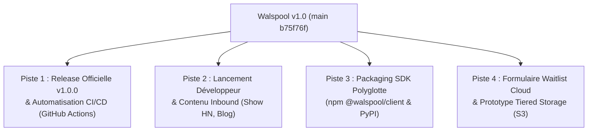

# Walspool — Document de Passation & Feuille de Route v1.0

> **Date de référence :** 05 Septembre 2026  
> **Auteur & Mainteneur Unique :** Yohann Hommet (`https://github.com/YohannHommet`)  
> **Dépôt :** [`YohannHommet/walspool`](https://github.com/YohannHommet/walspool) (Branche `main`, Commit `b75f76f`)  
> **Statut :** Cœur v1.0 durci, testé race-free, nettoyé, documenté et prêt pour la mise en production.

---

## 1. État Actuel du Projet (Réalisations Majeures)

### A. Cœur Technique Go & Performances Certifiées
- **Architecture Dual-Engine (Black-Box)** :
  1. **Moteur WAL Disque** : Group Commit utilisateurs 128 Ko, framing binaire de 29 octets avec intégrité IEEE CRC32, débit certifié de **1 074 441 ops/s** (1.41 µs/op, 1 allocation).
  2. **Hub d'Observabilité Mémoire** : Ring Buffer circulaire $O(1)$ (50 000 logs), index inversés `byTraceID` et `byService`, diffusion Server-Sent Events (SSE) non bloquante à **2 846 908 ops/s** (412 ns/op, 1 allocation), requêtes de trace en **< 2 µs**.
- **Remédiation Complète Fusionnée (PR #2 - `b75f76f`)** :
  - `SYS-01` : Préservation des entiers 64 bits (Twitter-Snowflake, nanosecondes) via `decoder.UseNumber()`.
  - `SYS-02` : Rollback physique réel (`rollbackTo`) sans zero-padding lors de pannes disque I/O.
  - `SYS-03` : OOM Guard sur crash recovery plafonnant la lecture d'en-têtes corrompus à 10 Mo.
  - `SYS-04` : `Close()` idempotent et synchronisant avec `sync.Once` et attente du flusher.
  - `ARCH-01` : Parsing Fail-Fast des variables d'environnement (`ErrPreconditionViolated`).
  - `ARCH-02` : Journalisation `slog.Error` des échecs du flusher d'arrière-plan.
  - `ARCH-03` : Prise en charge des en-têtes HTTP de routage (`X-Trace-ID`, `X-Service`, `X-Log-Level`).
  - `PERF-01` : Scanner lexical top-level sans allocation JSON (`scanTopLevelMeta`).
  - `PERF-02` : Déréférencement `traceList[0] = nil` éliminant toute fuite GC.
- **Concurrence & Dataraces** : 100% PASS sur `go test -v -race ./...` (0 race condition détectée).

### B. Gouvernance Juridique & Stratégie Commerciale
- **Attribution Exclusive** : Yohann Hommet est désigné comme l'unique créateur et mainteneur. Aucune mention d'organisation obsolète ne subsiste.
- **Licence Fair Source FSL-1.1-MIT** :
  - 100% gratuit et libre pour tout usage interne en entreprise, développeurs et recherche.
  - Clause anti-parasitisme interdisant à un concurrent ou cloud provider d'offrir un service managé commercial concurrent.
  - Conversion automatique en **MIT pur après 2 ans**.
- **Gouvernance des Contributions** : `CONTRIBUTING.md` intégrant le **DCO v1.1** (`git commit -s`) et la protection exclusive de la marque et du logo.
- **Feuille de Route Commerciale** : `docs/strategy/COMMERCIAL_STRATEGY.md` détaillant les 4 phases (Community FSL $\to$ Walspool Cloud SaaS $\to$ Walspool Enterprise On-Premise $\to$ Modèle hybride).

### C. Identité Visuelle & Expérience Développeur
- **Thème « Teenage Hardware »** : Canvas sombre `#08080A`, Vert Lime Électrique `#CCFF00`, Rouille Corten / Orange `#EA580C`.
- **Nouveau Logo Officiel** : W architectural en acier brossé avec tubes néon en dégradé vertical et attaches industrielles (`assets/logo.png`, WebP 69 Ko).
- **Suite Favicon Complète** : `favicon.ico` (multi-tailles), `favicon-16x16.png`, `favicon-32x32.png`, `apple-touch-icon.png` (180x180), `android-chrome-*.png`, `site.webmanifest`.
- **Cartes Réseaux Sociaux & OpenGraph** : Balises `og:image`, `twitter:card` intégrées dans `docs/index.html`.

### D. Restructuration Propre du Dépôt
- **Racine Standard Go** : Uniquement les fichiers Go du package racine `walspool`, `cmd/`, `docs/`, `assets/`, `examples/`, `go.mod`, `README.md`, `LICENSE`, `CONTRIBUTING.md`, `Dockerfile`.
- **Documentation Centralisée** :
  - `docs/architecture/` : `ARCHITECTURE.md`, `OBSERVABILITY_REPORT.md`
  - `docs/diagrams/` : `README.md` (rendu automatiquement par GitHub) + 5 schémas Draw.io XML
  - `docs/strategy/` : `COMMERCIAL_STRATEGY.md`
  - `docs/index.html` : Site GitHub Pages officiel
- **Suppression des Doublons** : Dossier `landing/` et captures d'écran de debug supprimés (~4 Mo nettoyés). `cmd/preview` configuré pour servir `docs/` sur le port 8088.

---

## 2. Les 4 Pistes d'Évolution Suggérées



### Piste 1 : Release Officielle v1.0.0 & Automatisation CI/CD *(Recommandée en priorité)*
1. **GitHub Actions Workflows (`.github/workflows/`)** :
   - `ci.yml` : Matrice de tests automatisés (Linux, macOS, Windows) sur Go 1.22 et 1.23 avec `go test -race ./...` et linter `golangci-lint`.
   - `release.yml` : Configuration GoReleaser pour compiler et attacher les binaires statiques (`walspool-sidecar_linux_amd64`, `arm64`, `darwin`, `windows.exe`) et publier l'image Docker officielle multi-architecture sur GitHub Container Registry (`ghcr.io/yohannhommet/walspool:v1.0.0`).
   - `pages.yml` : Déploiement automatique de `docs/` vers GitHub Pages sur chaque push `main`.
2. **Git Tag & Release GitHub** :
   - Tagger `v1.0.0` et rédiger une Release Note soignée avec badges, benchmarks certifiés et liens de téléchargement.

### Piste 2 : Lancement Communauté & Marketing Développeur (Inbound)
1. **Show HN (Hacker News)** :
   - Rédiger le pitch : *"Show HN: Walspool – An unkillable 1.1M ops/s Write-Ahead Log buffer & SSE telemetry stream in pure Go"*.
   - Mettre en avant le problème concret (les canaux Go en mémoire qui perdent tout au crash vs Kafka qui coûte 2000$/mois).
2. **Article Technique Deep-Dive (dev.to / Hashnode / Substack)** :
   - Titre : *"How We Built a Sub-Microsecond Write-Ahead Log in Go Without External Dependencies"*.
   - Expliquer les choix d'ingénierie : Group Commit 128 Ko, framing binaire de 29 octets avec CRC32 IEEE, Ring Buffer circulaire en mémoire et découplage Black-Box.
3. **Diffusion Réseaux** :
   - Posts calibrés pour `r/golang`, `r/devops`, `r/microservices`, Twitter/X et LinkedIn.

### Piste 3 : Distribution des SDK Clients (npm & PyPI)
1. **Package npm `@walspool/client`** :
   - TypeScript natif, zéro dépendance, support Fetch standard et EventSource / SSE, typages complets.
2. **Package PyPI `walspool-client`** :
   - Support Python synchrone (standard `urllib` / `requests`) et asynchrone (`httpx` / `aiohttp`).

### Piste 4 : Waitlist Walspool Cloud & Tiered Storage S3
1. **Landing Page Waitlist** :
   - Remplacer le formulaire lead actuel par une vraie capture d'emails (via Formspree, Resend ou webhook) pour la bêta privée **Walspool Cloud**.
2. **Spécification de l'Adaptateur S3 (`ports.go`)** :
   - Prototyper l'adaptateur `S3ParquetSink` implémentant `walspool.Sink` pour drainer le buffer local vers du stockage objet froid.

---

## 3. Synthèse des Commandes Utiles

```bash
# Vérification complète de la suite de tests et des dataraces
go test -v -race ./...

# Exécution des benchmarks officiels
go test -run=^$ -bench=. -benchmem ./...

# Lancer le serveur de prévisualisation local (docs/)
go run ./cmd/preview
# Disponible sur http://localhost:8088/

# Compiler le sidecar localement
go build -o ./bin/walspool-sidecar ./cmd/sidecar
```
