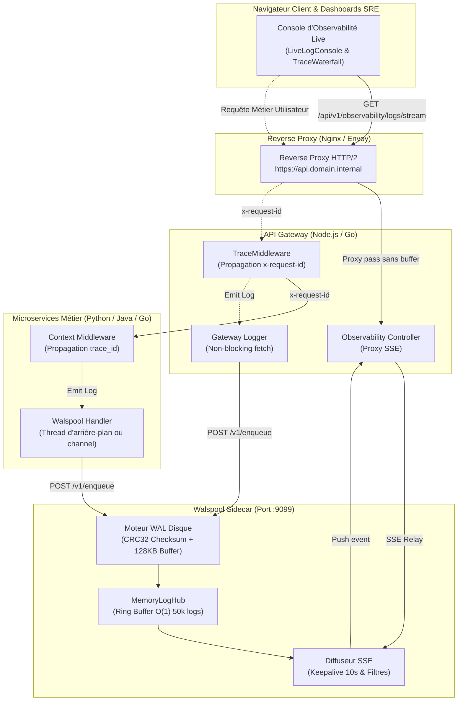
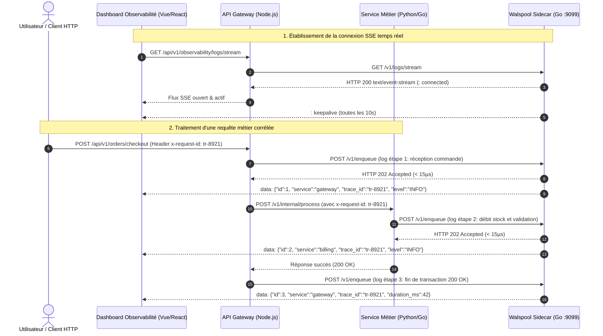

# 📡 Architecture d'Observabilité Distribuée & Streaming Temps Réel

> **Auteur & Mainteneur :** Yohann Hommet ([@YohannHommet](https://github.com/YohannHommet))  
> **Projet :** [`github.com/YohannHommet/walspool`](https://github.com/YohannHommet/walspool)  
> **Statut :** Spécification d'Ingénierie & Guide d'Intégration Polyglotte

---

## 1. Vue d'Ensemble & Principes Directeurs

Ce document détaille l'architecture d'observabilité distribuée de bout en bout propulsée par **Walspool**.

Le système applique rigoureusement la **Doctrine Black-Box** (Parnas, Meyer DbC, Cockburn Ports & Adapters, Ousterhout Deep Modules) pour résoudre le compromis historique entre fiabilité de stockage et observabilité en temps réel :

1. **Ingestion Ultra-Rapide & Tolérance aux Pannes Locale** :
   - Walspool opère directement à l'intérieur du pod ou sur le nœud hôte via son sidecar HTTP (`:9099`).
   - L'ingestion (`POST /v1/enqueue`) persiste immédiatement l'événement dans un journal append-only séquentiel (**Write-Ahead Log - WAL**) protégé par somme de contrôle **IEEE CRC32** avec Group Commit 128 Ko.
2. **Indexation Mémoire Circulaire $O(1)$ & Zero-GC Leak** :
   - En parallèle du disque, le **MemoryLogHub** maintient un Ring Buffer circulaire fixe (ex: 50 000 logs) avec index inversés secondaires par `trace_id` et par `service`.
   - L'éviction continue des anciens enregistrements s'effectue en temps constant $O(1)$ sans allocation dynamique continue, éliminant toute pause Garbage Collector.
3. **Diffusion Server-Sent Events (SSE) Découplée Hors Verrou** :
   - Les flux d'observabilité (`GET /v1/logs/stream`) diffusent instantanément chaque événement aux dashboards web ou consoles SRE.
   - Les clients lents ne ralentissent jamais le chemin critique d'ingestion grâce à un découpage strict : l'insertion dans le ring buffer se fait sous verrou court, tandis que la transmission vers les canaux abonnés s'exécute de manière non bloquante (`select ... default`).

---

## 2. Topologie Distribuée & Corrélation de Traces



---

## 3. Diagramme de Séquence : Flux de Requête & Diffusion Temps Réel



---

## 4. Intégration Polyglotte & Clients Inclus

Le dépôt fournit des clients de référence autonomes dans [`examples/`](../../examples/), conçus sans dépendances externes lourdes :

### A. Client Python Pur (`examples/python/client.py`)
Utilise exclusivement la bibliothèque standard (`urllib`) avec support complet du streaming SSE et reconnexion automatique :

```python
from client import WalspoolClient

client = WalspoolClient(endpoint="http://127.0.0.1:9099")

# Ingestion sub-microseconde avec intégrité CRC32
client.enqueue(
    topic="telemetry",
    payload={"order_id": "ord_99", "amount": 149.99},
    trace_id="tr-checkout-42",
    service="billing-svc",
    level="INFO"
)

# Écoute continue du flux SSE temps réel
for event in client.stream(service="billing-svc"):
    print(f"[{event['level']}] {event['service']} - {event['payload']}")
```

### B. Client Node.js / TypeScript (`examples/nodejs/client.js`)
Implémente un logger non bloquant utilisant l'API native `fetch` et `ReadableStream` :

```javascript
const { WalspoolClient } = require('./client');

const client = new WalspoolClient('http://127.0.0.1:9099');

// Envoi asynchrone non-bloquant
await client.enqueue({
  topic: 'orders',
  payload: { userId: 'usr_1', status: 'confirmed' },
  traceId: 'tr-checkout-42',
  service: 'api-gateway',
  level: 'INFO'
});
```

### C. Consommation Frontend Web (Vue 3 / React / Vanilla JS)
Connexion directe via l'API standard du navigateur `EventSource` :

```javascript
const eventSource = new EventSource('http://localhost:9099/v1/logs/stream?service=billing-svc');

eventSource.onmessage = (event) => {
  const log = JSON.parse(event.data);
  console.log("Nouveau log reçu en direct :", log);
};

eventSource.onerror = () => {
  console.warn("Reconnexion automatique du flux SSE en cours...");
};
```

---

## 5. Guide d'Exécution & Simulation Temps Réel

Pour vérifier le fonctionnement de bout en bout sur votre machine :

1. **Démarrer le sidecar Walspool** :
   ```bash
   go run ./cmd/sidecar -addr :9099 -data-dir ./tmp/spool
   ```

2. **Écouter le flux SSE dans un premier terminal** :
   ```bash
   curl -N http://127.0.0.1:9099/v1/logs/stream
   ```

3. **Émettre des événements corrélés via le client de démonstration** :
   ```bash
   python3 examples/python/client.py demo
   ```
   *Les événements s'affichent instantanément dans le premier terminal avec un temps de traversée sub-milliseconde.*

4. **Interroger l'historique d'une trace spécifique** :
   ```bash
   curl -s "http://127.0.0.1:9099/v1/logs?trace_id=tr-demo-42&limit=10" | jq .
   ```

---

## 6. Analyse Comparative & Justification Technique de Go

Le choix technologique de **Go** pour Walspool découle de contraintes d'ingénierie système fondamentales :

| Critère d'Évaluation | Go (Choix Walspool) | Node.js (Event Loop) | Python (GIL) |
| :--- | :--- | :--- | :--- |
| **Binaire & Déploiement** | Binaire statique autonome (~15 Mo, `CGO_ENABLED=0`) | Interpréteur Node + volumineux `node_modules` | Interpréteur Python + virtualenv |
| **Concurrence & Threads** | Goroutines légères (2 Ko) scalant à des millions | Mono-thread sensible aux blocages I/O disque | Global Interpreter Lock (GIL) limitant le parallélisme |
| **Empreinte RAM** | **< 20 Mo** (y compris avec 50 000 logs en ring buffer) | > 150 Mo | > 120 Mo |
| **I/O Système Séquentielles** | Accès direct `os.File` & `syscall` Append-Only | Abstractions streams & bindings libuv | Wrappers C / CPython avec overhead GIL |
| **Garbage Collection** | Scanner lexical sans allocation (`1 alloc/op`) | Ramasse-miettes V8 à cycles parfois perceptibles | Comptage de références + cycle collector |

---

## 7. Topologie Conteneurisée Docker & Configuration Nginx

### Topologie Réseau
- En production conteneurisée, Walspool est déployé en **Sidecar** dans le même pod Kubernetes (partageant `localhost`), ou sur le réseau bridge Docker interne (`http://walspool:9099`).
- Les microservices communiquent avec lui exclusivement par HTTP local, garantissant une isolation totale : si Walspool redémarre, aucun microservice ne subit de crash.

### Directives Nginx Reverse-Proxy (Anti-Buffering SSE)
Pour que les événements Server-Sent Events traversent un reverse-proxy Nginx sans délai de mise en mémoire tampon, appliquez ces directives :

```nginx
location /v1/logs/stream {
    proxy_pass http://127.0.0.1:9099/v1/logs/stream;
    proxy_http_version 1.1;
    proxy_set_header Connection "";
    
    # Directives critiques pour le streaming SSE en temps réel
    proxy_buffering off;
    proxy_cache off;
    chunked_transfer_encoding off;
    add_header X-Accel-Buffering "no";
    
    proxy_read_timeout 3600s;
    proxy_send_timeout 3600s;
}
```
Walspool émet un battement de cœur `: keepalive\n\n` toutes les 10 secondes, évitant la fermeture silencieuse des connexions TCP par les pare-feux réseau ou les équilibreurs de charge cloud.
