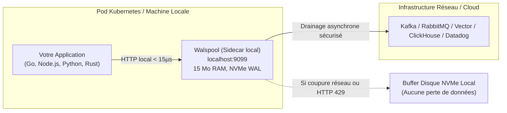

# Walspool v1.0 — Kit de Lancement Marketing Développeur

> **Auteur & Propriétaire Exclusif :** Yohann Hommet (`https://github.com/YohannHommet`)  
> **Dépôt Officiel :** [`https://github.com/YohannHommet/walspool`](https://github.com/YohannHommet/walspool)  
> **Version :** `v1.0.0`  
> **Licence :** Functional Source License Version 1.1 avec réversion MIT à 2 ans (`FSL-1.1-MIT`)  
> **Design System :** *Teenage Hardware* (`#08080A`, `#CCFF00`, `#EA580C`)

---

## Sommaire

1. [Stratégie & Calendrier de Diffusion](#1-stratégie--calendrier-de-diffusion)
2. [Thèse de Positionnement : En quoi Walspool diffère de Kafka, RabbitMQ et Redis ?](#2-thèse-de-positionnement--en-quoi-walspool-diffère-de-kafka-rabbitmq-et-redis-)
3. [Show HN (Hacker News) — Voix Ingénieur / Zéro Cliché](#3-show-hn-hacker-news--voix-ingénieur--zéro-cliché)
4. [Article Technique Deep-Dive (Dev.to / Hashnode / Blog)](#4-article-technique-deep-dive)
5. [Publications Communautaires Reddit](#5-publications-communautaires-reddit)
   - [Post r/golang : Focus Bas Niveau & Go Pur](#a-reddit-rgolang--focus-bas-niveau--go-pur)
   - [Post r/devops : Focus Fiabilité Pods & Kubernetes](#b-reddit-rdevops--focus-fiabilité-pods--kubernetes)
6. [Thread Twitter / X (Authentique & Percutant)](#6-thread-twitter--x-authentique--percutant)
7. [Post LinkedIn (Retour d'Expérience Architecte)](#7-post-linkedin-retour-dexpérience-architecte)

---

## 1. Stratégie & Calendrier de Diffusion

Pour maximiser l'effet de levier sans dispersion, la diffusion suit un séquençage précis en 48 heures :

| Moment | Canal | Cible & Angle | Objectif |
| :--- | :--- | :--- | :--- |
| **Jour J — 14h00 UTC** | **Hacker News (Show HN)** | Communauté hacker, ingénieurs systèmes | Étoiles GitHub, feedback architecture bas niveau |
| **Jour J — 14h30 UTC** | **Twitter / X** | Développeurs Go, Cloud Native, Edge | Découverte rapide, citations, snippets |
| **Jour J — 16h00 UTC** | **LinkedIn** | CTOs, VP Eng, Architectes de plateformes | Crédibilité technique, retours d'expérience B2B |
| **Jour J+1 — 13h00 UTC** | **Reddit (`r/golang`)** | Développeurs Go purs | Discussion technique (zéro dépendance, scanner lexical, GC) |
| **Jour J+1 — 15h00 UTC** | **Reddit (`r/devops`)** | Ingénieurs SRE & Kubernetes | Utilisation en Sidecar local anti-perte de logs |
| **Jour J+2 — 14h00 UTC** | **Dev.to / Hashnode** | Développeurs Backend / Distributed Systems | Référencement SEO et article de fond durable |

---

## 2. Thèse de Positionnement : En quoi Walspool diffère de Kafka, RabbitMQ et Redis ?

Le but de Walspool n'est **absolument pas de concurrencer ou de remplacer Kafka, RabbitMQ ou Redis**. Ces mastodontes sont des systèmes distribués centraux exceptionnels, conçus pour gérer des bus d'événements à l'échelle d'une entreprise ou des caches partagés en mémoire.

Walspool résout un angle mort auquel personne ne prête attention avant de perdre des données en production : **le dernier kilomètre avant le réseau (The First-Hop Reliability Problem)**.

### A. L'Analogie : L'Air-Bag Local vs Le Réseau Autoroutier Central

- **Kafka / RabbitMQ** sont les trains à grande vitesse et les autoroutes reliant des villes entières (les clusters centraux).
- **Redis** est la mémoire vive partagée d'une équipe de travail.
- **Walspool** est **l'air-bag et la boîte noire installés directement à l'intérieur du véhicule** (sur le nœud local, dans le même pod Kubernetes ou sur la même VM).



---

### B. Que se passe-t-il réellement en production sous défaillance ?

Imaginons que votre cluster Kafka, votre collecteur Vector ou votre endpoint Datadog rencontre un incident (glitch réseau VPC, certificat TLS expiré, redémarrage de brokers, ou saturation renvoyant des erreurs `HTTP 429 Too Many Requests`) :

#### 1. Avec Kafka / RabbitMQ directement dans l'application :
- **Si l'écriture est synchrone** : Le microservice attend la réponse du broker, ses workers s'accumulent, les threads se bloquent et l'application s'effondre en renvoyant des `HTTP 504 Gateway Timeout` aux utilisateurs finaux.
- **Si l'écriture est asynchrone** (in-memory buffer de librdkafka ou canal Go) : La file en RAM se remplit en 10 à 30 secondes. Si le nœud redémarre ou que l'OOM-Killer passe, **100 % des données en vol non transmises disparaissent**.
- **Pourquoi ne pas mettre Kafka ou RabbitMQ en sidecar local ?** C'est techniquement irréaliste : RabbitMQ nécessite la machine virtuelle Erlang (BEAM) et plusieurs centaines de mégaoctets de RAM. Kafka nécessite la JVM ou un runtime complexe, des gigaoctets de mémoire et plusieurs secondes de boot.

#### 2. Avec Redis localement :
- Redis est fondamentalement un magasin en **mémoire vive**.
- Si le backend aval est indisponible pendant 30 minutes sous fort trafic, Redis sature la RAM allouée. Dès que `maxmemory` est atteint, soit il évince arbitrairement les clés les plus anciennes (**perte silencieuse de données critiques**), soit il bloque avec une erreur `OOM command not allowed`.
- Si le conteneur Redis crashe ou redémarre avant le fsync de son AOF, les données volatiles sont perdues.
- Redis ne possède aucun mécanisme natif d'expédition automatique vers un tiers (pas d'outbox, pas de retry avec backoff exponentiel vers un endpoint HTTP).

---

### C. La Valeur Unique de Walspool (Le « Sweet Spot »)

Walspool a été conçu sur une idée radicale de simplicité : **un tampon matériellement inarrêtable à coût opérationnel quasi-nul**.

1. **Empreinte minimale** : Un binaire Go unique d'environ 15 Mo, démarrant en 5 millisecondes, consommant entre 15 et 30 Mo de RAM fixe (grâce à son Ring Buffer circulaire $O(1)$).
2. **Persistance disque pure (Zero RAM Bloat)** : Chaque log ingéré via `POST /enqueue` est écrit séquentiellement sur le disque NVMe local avec un Group Commit de 128 Ko et une intégrité CRC32 (1,07M ops/s). Même si le réseau extérieur est coupé pendant 3 heures, Walspool encaisse des gigaoctets sur disque sans faire grimper l'empreinte mémoire d'un seul mégaoctet.
3. **Moteur d'Expédition (Outbox Intégré)** : Un worker d'arrière-plan dépile les enregistrements par lots vers le backend de votre choix. S'il reçoit un `HTTP 429` ou une erreur réseau, il recule avec un backoff exponentiel, retient les données sur disque et reprend sans aucune perte dès le rétablissement.
4. **Arrêt Propre (Graceful Teardown K8s)** : Sur `SIGTERM`, Walspool stoppe les nouvelles connexions et draine l'intégralité du buffer disque vers le collecteur aval avant que Kubernetes ne termine le conteneur.
5. **Observabilité Immédiate sans Agent Lourd** : Un développeur ou SRE peut ouvrir un terminal et voir les logs de son pod défiler en temps réel via un simple `curl -N localhost:9099/v1/logs/stream` (flux Server-Sent Events natif).

---

### D. Tableau Comparatif Synthétique

| Critère | **Redis** | **RabbitMQ** | **Kafka / Redpanda** | **Walspool** |
| :--- | :--- | :--- | :--- | :--- |
| **Mission principale** | Cache & structures en mémoire | Broker de messages d'entreprise | Bus d'événements distribué central | **Amortisseur local de nœud & Outbox (Local Buffer)** |
| **Déploiement typique** | Cluster ou instance dédiée | Cluster central | Cluster multi-nœuds complexe | **Sidecar local sur `localhost:9099`** |
| **Empreinte mémoire** | Proportionnelle aux données (risque OOM) | 200 Mo – 2 Go (Erlang BEAM) | 1 Go – 8 Go (JVM / C++) | **~15 – 30 Mo fixe** (Ring Buffer $O(1)$) |
| **Garantie de persistance** | Mémoire (AOF asynchrone optionnel) | Disque + RAM | Disque distribué partitionné | **Disque NVMe local séquentiel (WAL + CRC32)** |
| **En cas de panne réseau aval** | Ne gère pas l'expédition vers l'aval | Bloque ou accumule en cluster | L'application émettrice bloque ou perd | **Écrit sur disque NVMe local sans saturer la RAM** |
| **Drainage vers l'aval** | Manuel (à coder par le client) | Consommateurs pull requis | Consommateurs pull requis | **Automatique intégré (HTTP, retry 429, backoff)** |
| **Live tail / Streaming direct** | Pub/Sub éphémère | Queues temporaires | Consumer groups à créer | **SSE natif en direct (`curl -N /v1/logs/stream`)** |
| **Dépendances & Runtime** | C | Erlang VM | Java / C++ / Zookeeper / KRaft | **Go pur (0 dépendance, binaire statique)** |

---

## 3. Show HN (Hacker News) — Voix Ingénieur / Zéro Cliché

```text
Show HN: Walspool – A lightweight Write-Ahead Log daemon in pure Go

Hey HN,

I’m Yohann (https://github.com/YohannHommet). Over the last few months I built Walspool, a single-binary daemon that acts as an unkillable local buffer and live log stream for microservices.

Why build this?
In almost every team I've worked with, we faced the same annoying tradeoff for telemetry and background events:
- In-memory queues (Go channels, Python queues, Redis): fast, until an OOM or a Kubernetes rolling update kills the pod, taking whatever logs were queued with it.
- Full brokers (Kafka, RabbitMQ): solid, but running a cluster just to buffer edge node logs before forwarding to ClickHouse, Vector, or Datadog is operationally heavy and expensive.

I wanted something dumb, resilient, and minimal: a process running alongside the app on localhost, accepting logs over HTTP, dumping them immediately to an append-only file with CRC32 verification, and draining them downstream when the network allows.

A few technical decisions from the implementation:

1. Zero external Go dependencies: It only uses the Go standard library. The binary compiles to ~15MB statically with CGO_ENABLED=0.

2. Group Commit & 29-byte framing: Writing each entry to disk with fsync kills throughput. Walspool batches appends in a 128KB buffer with a simple binary header (magic bytes, CRC32, uint64 record ID, nanosecond timestamp, payload length). On a decent NVMe drive, it clocks at around 1.07M ops/sec.

3. Crash recovery without zero-padding: A bug I frequently hit with simpler WALs is that a failed append leaves zeroed bytes at the tail, confusing subsequent recovery. Walspool records the physical offset before writing (`rollbackTo`) and truncates the file immediately on write failure. Replay on startup also enforces an OOM guard (records claiming to be >10MB are rejected instead of allocating gigabytes).

4. Zero-alloc metadata extraction: For live inspection (`GET /v1/logs/stream` via SSE), parsing JSON with `json.Unmarshal` for every entry crushed the garbage collector under load. I wrote a small lexical byte scanner (`scanTopLevelMeta`) that extracts `trace_id`, `service`, and `level` directly from raw slices without heap allocations.

What Walspool is NOT:
It is not a distributed broker. It does not replace Kafka or RabbitMQ, and does not do multi-node clustering. It sits right in front of them, acting as the local shock absorber on the node so your microservice never drops data when the downstream is rate-limiting or recovering.

Licensing:
The code is under FSL-1.1-MIT (Fair Source). It’s completely free for internal commercial use, but prevents cloud providers from wrapping it as a managed service for 2 years, after which each release automatically reverts to standard MIT.

Code: https://github.com/YohannHommet/walspool
Docs & live demo: https://yohannhommet.github.io/walspool

Curious to hear how you deal with edge buffering in your stacks, and happy to answer questions about the file format or the SSE hub.
```

---

## 4. Article Technique Deep-Dive

**Titre :** *Building a Sub-Microsecond Write-Ahead Log in Pure Go: Dual-Engine Architecture, Zero Allocations, and Crash-Proof Group Commit*  
**Plateformes :** Dev.to / Hashnode / Substack / Blog technique

```markdown
# Building a Sub-Microsecond Write-Ahead Log in Pure Go: Dual-Engine Architecture, Zero Allocations, and Crash-Proof Group Commit

When building high-throughput telemetry pipelines, backend engineers often hit an uncomfortable architectural compromise:
- **In-memory queues** offer microsecond latency, but a pod restart or crash means instant data loss.
- **Enterprise brokers (Kafka, RabbitMQ)** guarantee durability, but running a multi-node broker just to buffer local node logs is operational overkill.

In this article, we dive deep into the internals of **Walspool** (https://github.com/YohannHommet/walspool), an open-source Dual-Engine daemon built in pure Go without external dependencies, certified at **1.07M disk ops/sec** and **2.84M in-memory stream ops/sec**.

---

## 1. The Architectural Role: The Local Shock Absorber

Walspool does not aim to replace Kafka or RabbitMQ. It solves the **first-hop delivery problem**:

```text
[Your App] ---> (localhost:9099) ---> [Walspool Disk WAL] ---> (Internet / VPC) ---> [Kafka / ClickHouse / Datadog]
```

When the central Kafka cluster or telemetry collector is unreachable (DNS glitch, rate limiting HTTP 429, rolling deploy), Walspool absorbs all incoming events sequentially onto local NVMe storage without consuming container RAM. As soon as the central pipe recovers, its background dispatcher drains batches automatically with exponential backoff.

---

## 2. Disk Engine: 29-Byte Binary Framing & 128 KB Group Commit

Writing every log with an individual `fsync` crushes NVMe throughput to ~10,000 IOPS. To reach **1,074,441 ops/s**, Walspool implements a user-space **Group Commit** buffer:

1. **29-byte binary wire header**:
   - `[0..1]`: Magic bytes `0x57 0x53` (`WS`)
   - `[2]`: Wire version `0x01`
   - `[3..6]`: IEEE CRC32 checksum of payload & metadata
   - `[7..14]`: Monotonic Record ID (64-bit)
   - `[15..22]`: Unix timestamp in nanoseconds (64-bit)
   - `[23..24]`: Topic length (uint16)
   - `[25..28]`: Payload length (uint32)

2. **Group Commit 128 KB**: Incoming records are packed into a pre-allocated byte buffer. The buffer flushes to kernel page cache via `io.Writer` and syncs sequentially.

3. **Crash Recovery without Zero-Padding**: Many WAL implementations pad aborted writes with zeros, creating corrupted states upon reboot. Walspool records the exact physical file offset before each append (`rollbackTo`). If a disk I/O fault occurs, it executes `file.Truncate(rollbackTo)` immediately.

4. **OOM Guard on Startup**: To prevent corrupt files from triggering allocation of gigabytes of RAM during replay, headers are inspected against an `OOM Guard` threshold (10 MB maximum payload per record).

---

## 3. In-Memory Hub: Zero-Allocation Lexical Scanning

In addition to disk persistence, engineers need live tailing (`curl -N /v1/logs/stream`) and fast trace lookups (`/v1/logs?trace_id=...`). 

Parsing JSON with `json.Unmarshal` for millions of incoming logs allocates heap memory and chokes the Go garbage collector. Walspool uses an in-place lexical scanner (`scanTopLevelMeta`):

- Inspects raw bytes directly without allocating intermediate strings or structs.
- Extracts `trace_id`, `service`, and `level` at the top level of valid JSON.
- Stores records in an $O(1)$ ring buffer with inverted index maps.
- GC Leak Prevention: On ring overwrites, previous entry pointers are explicitly nilled (`traceList[0] = nil`), preventing memory leaks.

Result: **2,846,908 ops/s** with 1 heap allocation per operation.

---

## 4. Concurrency & Graceful Draining

A major problem in logging sidecars is abrupt termination during Kubernetes deployments (`SIGTERM`). Walspool enforces a deterministic 4-stage shutdown:

1. **Close LogHub**: Immediately unblocks long-lived HTTP Server-Sent Events client connections.
2. **Shutdown HTTP Server**: Stops accepting new `/enqueue` requests and finishes in-flight requests.
3. **Flush Spooler**: Forces background dispatchers to drain all pending disk records to downstream sinks (with exponential backoff on HTTP 429/503).
4. **Close Storage Engine**: Safely syncs and closes OS file descriptors.

The entire test suite (`go test -race ./...`) passes with zero race conditions.

---

## 5. Benchmarks Summary

| Metric | Disk WAL Engine | In-Memory Hub |
| :--- | :--- | :--- |
| **Throughput** | **1,074,441 ops/sec** | **2,846,908 ops/sec** |
| **Latency** | **1.41 µs / op** | **412 ns / op** |
| **Allocations** | 1 alloc / op | 1 alloc / op |
| **Integrity** | IEEE CRC32 checksum | Circular Ring Buffer $O(1)$ |

Check out the code, run the benchmarks, and star the repo:
👉 https://github.com/YohannHommet/walspool
```

---

## 5. Publications Communautaires Reddit

### A. Reddit `r/golang` : Focus Bas Niveau & Go Pur

**Titre :**  
`Built a 1M ops/s Write-Ahead Log in pure Go (stdlib only, zero dependencies)`

**Texte :**

```text
Hey everyone,

I wanted to share a project I've been refining: Walspool (https://github.com/YohannHommet/walspool). It's a local WAL daemon and real-time log hub written in standard Go without a single third-party package in `go.mod`.

I wrote it because I wanted a local disk buffer that wouldn't drop events when a container gets restarted by Kubernetes, but without pulling in CGO dependencies (like SQLite or RocksDB) or running a full broker.

Some implementation details fellow Go developers might find interesting:

- No JSON reflection in the hot path: The daemon serves a live SSE stream (`/v1/logs/stream`) and stores recent logs in an in-memory ring buffer. Instead of doing `json.Unmarshal` into an `interface{}` or map on every ingest, a custom lexical scanner (`scanTopLevelMeta`) walks the byte slice to find `trace_id` and `service`. This cut allocations down to 1 per op.
- Preserving 64-bit IDs: We use `decoder.UseNumber()` so snowflake IDs (Twitter/Discord style) aren't silently converted into float64 and mangled.
- Memory leak prevention on ring buffer wrap: In Go, when an in-memory ring buffer overwrites old slots, keeping slices inside sub-arrays can prevent the GC from reclaiming referenced payloads. We explicitly set the overwritten slice reference to nil before moving the pointer.
- 100% race-free: Passed under `go test -race ./...` across macOS, Linux, and Windows in CI.
- Shutdown sequence: When receiving SIGTERM, it first closes the LogHub (which unblocks open SSE connections immediately), stops HTTP ingress, forces a flush of pending disk buffers to the downstream sink, and finally closes the file handles.

The repo is at https://github.com/YohannHommet/walspool. 

Benchmarks, issues, and code reviews on the storage engine are very welcome.
```

---

### B. Reddit `r/devops` : Focus Fiabilité Pods & Kubernetes

**Titre :**  
`Tired of losing telemetry on pod restarts: I built a lightweight (~15MB) WAL buffer daemon`

**Texte :**

```text
Hi r/devops,

Quick question: how do your services handle telemetry when your downstream collector (Vector, OpenTelemetry Collector, Datadog agent) is temporarily unresponsive or rate-limiting you?

Most apps either:
1. Buffer in memory (channels, ring buffers). If the pod gets killed or OOM'd during a deployment rollout, un-flushed logs vanish.
2. Block the main request path waiting for network I/O.

I built Walspool to solve this specific edge case. It’s a sidecar daemon designed to run in the same pod (or on the same VM) on `localhost:9099`:

- Apps send logs via HTTP POST (`/enqueue`).
- It writes them to a local disk WAL (NVMe/EBS) in microsecond time with CRC32 integrity.
- A background routine ships batches to your actual backend. If the downstream responds with `HTTP 429` (Rate Limited) or `503`, Walspool pauses, backs off, and retains everything on disk until recovery.
- On `SIGTERM`, it executes a 4-step graceful drain to ship pending batches before Kubernetes tears down the container.
- Includes `/readyz` (fails if storage is full or process is draining), `/healthz`, and standard Prometheus `/metrics`.

It runs as a non-root Alpine container (~15MB) with multi-arch support:
`docker run -p 9099:9099 -v /tmp/spool:/data/spool ghcr.io/yohannhommet/walspool:v1.0.0`

Code and K8s manifests are on GitHub: https://github.com/YohannHommet/walspool

Feedback on how you handle sidecar backpressure is very welcome!
```

---

## 6. Thread Twitter / X (Authentique & Percutant)

**Tweet 1 :**  
If your app buffers logs in memory, every Kubernetes pod restart or OOM kills your in-flight telemetry.  
If you run Kafka just to buffer local node events, you're overpaying.  

I built Walspool: a single 15MB Go binary that acts as an unkillable disk buffer and live SSE stream.  
https://github.com/YohannHommet/walspool

---

**Tweet 2 :**  
How it works:  
1. App POSTs logs to `localhost:9099/enqueue`  
2. Written to disk WAL with 128KB Group Commit & CRC32 (1M+ ops/s)  
3. Background worker ships batches downstream (with auto-backoff on HTTP 429)  
4. Streams live logs via SSE: `curl -N localhost:9099/v1/logs/stream`

---

**Tweet 3 :**  
A detail I care about: zero external dependencies.  
No CGO, no third-party Go packages, clean `go test -race ./...`.  
Physical disk rollback on write failure (no corrupt zero-padded tails).  

Try the Docker image:  
`docker run -p 9099:9099 ghcr.io/yohannhommet/walspool:v1.0.0`

---

**Tweet 4 :**  
Walspool is licensed under Fair Source FSL-1.1-MIT (free for internal commercial use, 100% reverts to MIT in 2 years).  

Check out the code and architecture docs:  
https://github.com/YohannHommet/walspool

---

## 7. Post LinkedIn (Retour d'Expérience Architecte)

```text
Dans la plupart des architectures de microservices, la fiabilité de la télémétrie repose sur un compromis bancal :

Soit on garde les logs en mémoire pour aller vite, et le moindre redémarrage de pod Kubernetes fait disparaître les événements en transit.
Soit on met en place des briques lourdes (brokers distribués, clusters dédiés) qui demandent une maintenance disproportionnée pour du simple tamponnage local.

J'ai conçu Walspool pour combler ce vide : un composant autonome d'environ 15 Mo, sans aucune dépendance externe, qui sert d'absorbeur de chocs local sur disque NVMe.

Ce n'est pas un remplaçant de Kafka ou de RabbitMQ. C'est le maillon manquant en amont :
- L'application dépose ses logs en local sur localhost:9099 (< 15 µs).
- Walspool garantit la persistance immédiate sur disque avec un Group Commit de 128 Ko et intégrité CRC32 (plus d'un million d'écritures par seconde).
- Si le collecteur central (Vector, Datadog, Kafka) est temporairement indisponible ou renvoie du HTTP 429, Walspool encaisse sur disque sans toucher à la mémoire vive du conteneur, puis dépile dès le retour à la normale.
- En prime, un simple "curl -N localhost:9099/v1/logs/stream" permet de suivre ses logs en streaming temps réel (SSE) sans installer d'agent lourd.

Le projet est open-source (sous licence Fair Source FSL-1.1-MIT) :
Dépôt GitHub : https://github.com/YohannHommet/walspool
Documentation : https://yohannhommet.github.io/walspool

Retours d'expérience et discussions techniques bienvenus en commentaire.
```
